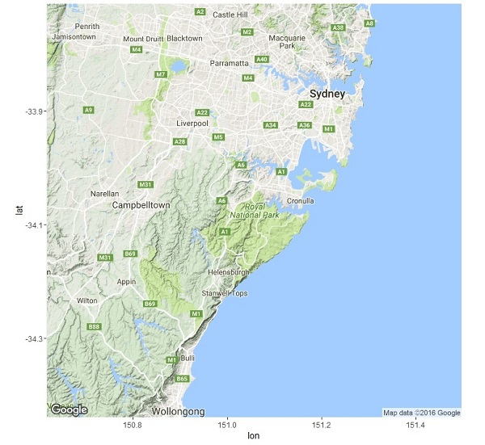
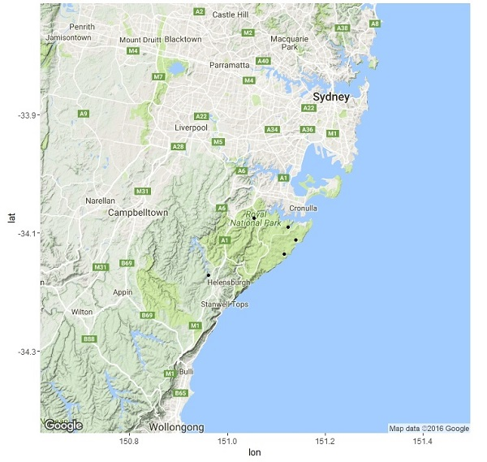
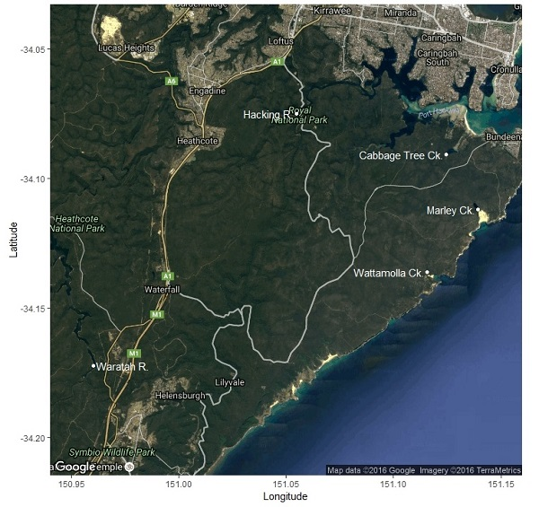
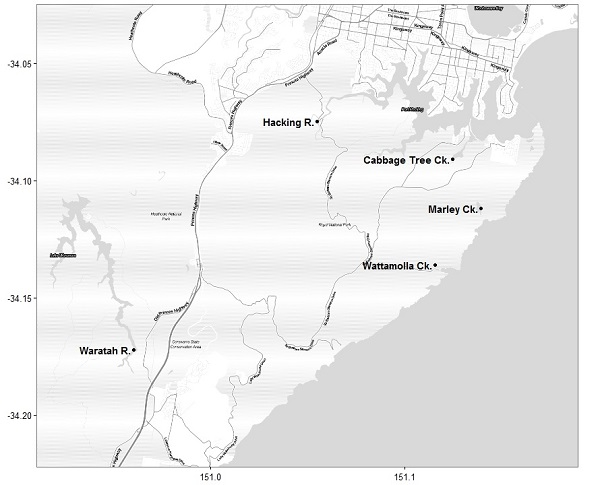

Being able to make a simple map is a very useful skill for all sorts of applications. Here, we will introduce some of the basics of working with spatial data, and use R to produce simple and easy maps. You could use the same technique to make a map for a presentation, or a figure for a report or publication. 

There are many packages that are useful for plotting and manipulating spatial data in R. For simplicity, we're going to solely use the package [ggmap](https://cran.r-project.org/web/packages/ggmap/index.html) for this exercise. To get started, install this package and load into R.
  
```{r, warning=F,message=F}
library(ggmap)
```
<br><br>

###Making your first map
<br>
In this example, let's say we collected data from five sites near Royal National Park in New South Wales, Australia, and want to display the locations we visited. 

Using the function `get_map`, we can download an image from Google maps at any named location and then plot it with the function `ggmap`. 

```{r, warning = FALSE,message=F,eval=F}
basemap <- get_map('Royal National Park')
ggmap(basemap)
```



The argument of `get_map` is simply any place searchable on Google Maps (in this case 'Royal National Park') - easy!   

To add point data for our five survey sites, we first need to make a new data frame holding the place name, latitude and longitude of each site (or import this data from a spreadsheet).

```{r}
ptdata <- data.frame("PlaceName" = c(" Hacking R. ", " Cabbage Tree Ck. ", 
                                     " Marley Ck. ", " Wattamolla Ck. ", 
                                     " Waratah R. "), 
                     "Long" = c(151.054823, 151.124566, 151.139216, 
                             151.115645, 150.960431), 
                     "Lat" = c(-34.074918, -34.090796, -34.111972, 
                             -34.136046, -34.172308))                       
```

We can add these points to our map based on the Latitude (y) and Longitude (x) coordinates. It is important that the points and the other features on the map work on the same scale - or 'projection'. These locations were estimated from Google Maps data for this reason - estimate your own via [LatLong.net](http://latlong.net)).

```{r, warning = FALSE,message=F,echo=F}
basemap <- get_map('Royal National Park')
```

```{r,eval=F}
ggmap(basemap) + geom_point(data=ptdata, aes(x=Long, y=Lat))
```



Well done -you made your first map with R! Easy! You may have noticed that `ggmap` uses familiar graphics code from the package ggplot (see [plotting with ggplot](http://environmentalcomputing.net/plotting-with-ggplot/)).  
<br><br>

### Making a presentation-ready map
<br>
By tweaking a few options, we can make this look more suitable for a presentation.   

First, adjust some of the options in `get_map`:

* use `bound` to choose the extent/bounding box of the map. Here, we are using the minimum and maximum values of latitude and longitude from our site coordinates 
* try `maptype = "hybrid"` to see the satellite imagery and roads data   
* increase the `zoom` level to improve detail   
  
```{r, message = FALSE, warning = FALSE}
bound <- c(left = min(ptdata$Long), bottom = min(ptdata$Lat), 
           right = max(ptdata$Long), top = max(ptdata$Lat))

Pres_basemap <- get_map(bound, zoom = 12, maptype = "hybrid")
```

Second, adjust some of the options for plotting:

`geom_point` tweaks for the dots at each site location:
* use `colour = "white"` to have the points stand out  
* use `size` to change point size  

`geom_text` tweaks for the labels for each site:  

* use `size` to change text size 
* use `colour = "white"` to have the labels stand out 
* use `hjust` and `vjust` adjust the horizontal and vertical position of labels  
* use `labs` to define the *x* and *y* axis labels  

```{r, message = FALSE, warning = FALSE,eval=F}
ggmap(Pres_basemap) + 
  geom_point(data = ptdata, aes(x=Long, y=Lat, label=PlaceName), 
             colour = "white") +
  geom_text(data = ptdata, 
            aes(x=Long, y=Lat, label = PlaceName),
            size = 4, 
            colour = "white",
            hjust = "inward") +
  labs(x = "Longitude", y = "Latitude")
```


<br><br>

### Making a publication-ready map
<br>
For a paper or report, you probably want a simpler black and white map.

* use `bound` to set the extent as above  
* try `get_stamenmap` to get an austere basemap (eg. Stamen "toner-lite")   
* use `theme_bw()` from ggplot to get a stripped-back theme   
  
```{r, message = FALSE, warning = FALSE,eval=F}
Pub_bound <- c(left = min(ptdata$Long) - 0.05, bottom = min(ptdata$Lat) - 0.05, 
           right = max(ptdata$Long) + 0.05 , top = max(ptdata$Lat) + 0.05)
Pub_basemap <- get_stamenmap(Pub_bound, zoom = 13, maptype = "toner-lite")

ggmap(Pub_basemap) + 
  geom_point(data = ptdata, aes(x=Long, y=Lat, label=PlaceName)) +
  geom_text(data = ptdata, 
            aes(x=Long, y=Lat, label = PlaceName),
            size = 4,
            fontface = "bold",
            hjust = "right") +
  theme_bw() +
  theme(axis.title = element_blank())
```

<br><br>

### Further help
<br>
Read the [ggmap](https://cran.r-project.org/web/packages/ggmap/index.html) documentation for more examples and ideas.

[ggmap cheat sheet](https://www.nceas.ucsb.edu/~frazier/RSpatialGuides/ggmap/ggmapCheatsheet.pdf) from the National Centre for Ecological Analysis and Synthesis.
<br><br>

**Author**: Kingsley Griffin
<br>
Last updated:
```{r,echo=F}
date()
```


