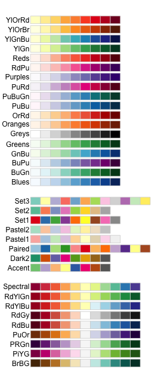
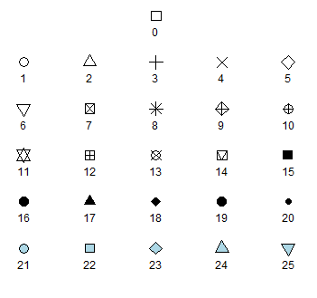

**ggplots** are almost entirely customisable. This gives you the freedom to create a plot design that perfectly matches your report, essay or paper. 

The overall appearance can be edited by changing the overall appearance and the colours and symbols used.

Before you get started, read the page on the [basics](http://environmentalcomputing.net/plotting-with-ggplot-the-basics/) of plotting with ggplot and install the package ggplot2.

```{r,warning=F}
library(ggplot2)
```
<br><br>


In these examples, let's use a data set that is already in R with the length and width of floral parts for three species of iris. First, load the data set:

```{r}
data(iris)
```

The following plots will be used as the base code throughout of this tutorial  
* a scatter plot of petal length vs sepal length  
* a box plot of sepal length vs species  
* a frequency histogram of sepal length  

```{r, echo=TRUE, message=F, warning=F}
IrisPlot <- ggplot(iris, aes(Sepal.Length, Petal.Length)) + geom_point() 

IrisBox <- ggplot(iris, aes(Species, Sepal.Length, fill = Species)) + geom_boxplot()

IrisHist <- ggplot(iris, aes(Sepal.Length)) + geom_histogram() 
```

```{r,echo=F,message=F, warning=F}
library(gridExtra)
grid.arrange(IrisPlot, IrisBox, IrisHist, ncol=2)
```
<br><br>

### Changing the colour of the whole plot or its outline
<br>
To colour your entire plot one colour, add `fill = "colour"` or `colour = "colour"` into the brackets following the `geom_...` code where you specified what type of graph you want. 

Note that for most plots, `fill = "colour"` will colour the whole shape, whereas `colour = "colour"` will fill in the outline.

For example, to make a blue box plot with a red outline, or a yellow histogram with an green outline::

```{r}
IrisBox <- ggplot(iris, aes(Species, Sepal.Length)) + geom_boxplot(fill = "blue", colour = "red") 

IrisHist <- ggplot(iris, aes(Sepal.Length)) + geom_histogram(fill = "yellow", colour = "green")
```

```{r,echo=F,message=F, warning=F}
grid.arrange(IrisBox, IrisHist, ncol=2)
```

For scatterplots, `colour = "colour"` will specify the fill colour for the point shape. 

```{r}
IrisPlot <- ggplot(iris, aes(Petal.Length, Sepal.Length)) + geom_point(colour = "red") 
```

```{r,echo=F,message=F, warning=F}
print(IrisPlot)
```

The plots and outlines can be changed to any colour listed [here](http://www.stat.columbia.edu/~tzheng/files/Rcolor.pdf). Remember to include "" before and after the colour name. 
<br><br>

### Using colour to visualise additional variables
<br>
**Additional categorical variables**

If you wish to colour point on a **scatter plot** by a third categorical variable, then add `colour = variable.name` within your `aes` brackets. This tells ggplot that this third variable will colour the points. To colour the points by the variable Species:

```{r}
IrisPlot <- ggplot(iris, aes(Petal.Length, Sepal.Length, colour = Species)) + geom_point() 
```

```{r,echo=F,message=F, warning=F}
print(IrisPlot)
```

To colour **box plots** or **bar plots** by a given categorical variable, you use you use `fill = variable.name` instead of `colour`.

```{r}
IrisBox <- ggplot(iris, aes(Species, Sepal.Length, fill = Species)) + geom_boxplot() 
```

```{r,echo=F,message=F, warning=F}
print(IrisBox)
```
<br><br>

**Additional continuous variables**

The basic format for colouring a continuous variable is very similar to a categorical variable. The only real difference is you need to use `+ scale_colour_gradient(low = "colour1", high = "colour2")`. The other colour scales will not work as they are for categorical variables. For example, here is a plot of sepal length vs petal length, with the symbols colored by their value of sepal width.

```{r}
IrisPlot.continuous <- ggplot(iris, aes(Petal.Length, Sepal.Length, colour = Sepal.Width)) + geom_point()

print(IrisPlot.continuous)
```

To make the gradient more effective, specify two colours within the `+ scale_colour_gradient` brackets to represent either end of the gradient. For example: 

```{r}
print(IrisPlot.continuous + scale_colour_gradient(low = "black", high = "white"))

print(IrisPlot.continuous + scale_colour_gradient(low = "darkolivegreen1", high = "darkolivegreen"))
```
<br><br>

### Choosing your own colours for these variables
<br>
This can be done in numerous ways. The basic format is to add `+ scale_colour_yourchoice()` for scatter plots or `+ scale_fill_yourchoice()` for box plots to the code where you 'print' your graph, where `yourchoice()` is one of several options. The syntax is:

`print(your.basic.graph + your.theme + scale_colour_yourchoice())`

There are numerous options for the `+ scale_colour_yourchoice()` part.

**Individually select colours.**  To manually choose colours, you can use `+ scale_colour_manual()` or `+ scale_fill_manual()`. For example, to choose three colours for the iris plots:

```{r} 
print(IrisPlot + scale_colour_manual(values = c("Blue", "Red", "Green")))

print(IrisBox + scale_fill_manual(values = c("Black", "Orange", "Brown")))
```


**Assign tones on a greyscale.** Use `+ scale_colour_grey()` or `+ scale_fill_grey()` 

```{r}
print(IrisPlot + scale_colour_grey())

print(IrisBox + scale_fill_grey())
```

**Assign colours from a pre-made pallette.** Use `+ scale_colour_brewer()` or `+ scale_fill_brewer`. To do this you will need to install the package [RColorBrewer](https://cran.r-project.org/web/packages/RColorBrewer/index.html) and load in R.

```{r, echo= TRUE, warning=F}
library(RColorBrewer)
```



This can then be added to the end of your graph code just like the others `+ scale_colour_brewer(palette = "chosen.palette")` for scatterplots and `+ scale_fill_brewer(palette = "chosen.palette")` for boxplots, where `"chosen.pallete"` is one of the available palletes. For example,

```{r}
print(IrisPlot + scale_colour_brewer(palette = "Dark2"))

print(IrisBox+ scale_fill_brewer(palette = "Oranges"))
```
<br><br>

### Changing symbols in a scatterplot
<br>
In a simple scatterplot with no grouping variables, you can change the shape of the symbol by adding `shape = ?` to the `geom_point()` code, where ? is one of the following numbers for different shapes.



For example, to use a filled triangle,

```{r}
IrisPlot <- ggplot(iris, aes(Petal.Length, Sepal.Length)) + geom_point(shape = 17) 
```

```{r,echo=F}
print(IrisPlot)
```

Different symbols can be used to group data in a scatterplot. This can be very helpful when printing in black and white or to further distinguish your categories. 

To do this, you need to add  `shape = variable.name` within your basic plot `aes` brackets, where `variable.name` is the name of your grouping variable. For example, to have different symbols for each species, we would use.

```{r}
IrisPlot.shape <- ggplot(iris, aes(Petal.Length, Sepal.Length, shape = Species)) + geom_point() 
```

```{r,echo=F}
print(IrisPlot.shape)
```

To set the symbols manually, we can use the symbol codes in `scale_shape_manual()` added to your print function.

```{r}
print(IrisPlot.shape + scale_shape_manual(values = c(0, 16, 3)))
```

This can be used with colour to further distinguish and group your variables. 

```{r}
IrisPlot.shape <- ggplot(iris, aes(Petal.Length, Sepal.Length, shape = Species, colour = Species)) + geom_point() 

print(IrisPlot.shape + scale_shape_manual(values = c(0, 16, 3)) + scale_colour_manual(values = c("chartreuse4", "chocolate", "slateblue4")))
```
<br><br>

###Further help
<br>
To further customise the aesthetics of the graph, including colour and formatting, see our other ggplot help pages:  
*[altering overall appearance](http://environmentalcomputing.net/plotting-with-ggplot-altering-the-overall-appearance/).  
*[adding titles and axis names](http://environmentalcomputing.net/plotting-with-ggplot-adding-titles-and-axis-names/)  
   
Help on all the ggplot functions can be found at the [The master ggplot help site](http://docs.ggplot2.org/current/).

A useful cheat sheet on commonly used functions can be downloaded [here](https://www.rstudio.com/wp-content/uploads/2015/03/ggplot2-cheatsheet.pdf).

<p style="margin-left: .5in; text-indent: -.5in;">Chang, W (2012) *R Graphics cookbook.* O'Reilly Media. - a guide to ggplot with quite a bit of help online [here](http://www.cookbook-r.com/Graphs/)</p>
<br><br>

**Author**: Fiona Robinson
<br>
Last updated:
```{r,echo=F}
date()
```
