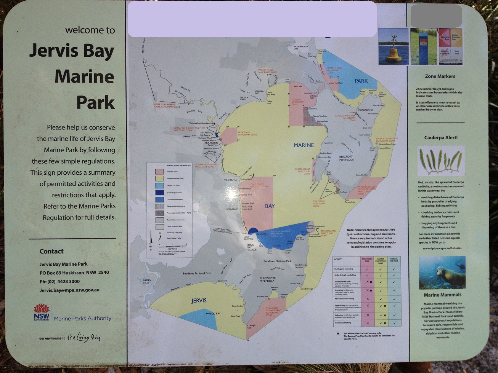

```{r, echo=FALSE}
# If instructor copy, use INST = TRUE to see inline code output.
library(knitr)
INST = TRUE

if (INST == TRUE) opts_chunk$set(fig.keep = 'all', results = 'markup', echo = TRUE)
if (INST == FALSE) opts_chunk$set(fig.keep = 'none', results = 'hide', echo = FALSE)

```



A fisheries officer was checking whether recreational fishers were aware of the regulations that governed where fishing is allowed around a marine park at Jervis Bay. Boats were approached on a busy holiday weekend at Easter and asked whether they had a map of the marine park and were aware of the location of the sanctuary zones where fishing was prohibited. They were also asked whether they were locals or tourists to the area. The officer collected the following data (number of boats).

Aware of sanctuary zones, Not aware of sanctuary zones
Locals,	28,	5
Tourists,	12,	10


**Q1** What statistical test could you use to test the hypothesis that tourists and locals differed in their awareness of where they are allowed to fish in the marine park?


**Q2** Conduct the test, and give the value of the test statistic and P value

```{r}
sanctuary = matrix(c(28,12,5,10), nrow=2, dimnames = list(c("Locals", "Tourists"), c("Aware of sanctuary zones", "UnAware of sanctuary zones")))
sanctuary
chisq.test(sanctuary, correct = F)
```


**Q3**  Write a paragraph that the fisheries officer could use to explain the results of their test to their manager, with recommendations on what group of people should be targeted for programs aimed at further educated people about the marine park zoning regulations.