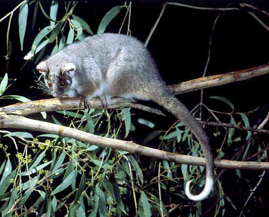

```{r, echo=FALSE}
# If instructor copy, use INST = TRUE to see inline code output.
library(knitr)
INST = FALSE

if (INST == TRUE) opts_chunk$set(fig.keep = 'all', results = 'markup', echo = TRUE)
if (INST == FALSE) opts_chunk$set(fig.keep = 'none', results = 'hide', echo = FALSE)

```



You are a behavioural ecologist studying the diet of common ringtail possums (*Pseudocheirus peregrinus*) at two sites (sites A and B) dominated by two species of Eucalyptus, (*E. ovata* and *E. sideroxylon*).

You notice that possums at site A tend to eat  *E. ovata* and that at location B they mostly eat  *E. sideroxylon*. To test whether the populations at each site differ in the feeding preferences, you attach radio collars to seven possums at location A and eight possums at location B. You track each possum and note the species of the first tree that you observe it eating leaves from.

At location A you see six possums eat *E. ovata* and one (1) eat *E. sideroxylon*. At location B, none eat *E. ovata* and you see all eight eat *E. sideroxylon*. 


**Q1** What is the exact probability of observing this or a more extreme pattern by chance alone?

```{r}
possum = matrix(c(6,0,1,8), nrow=2, dimnames = list(c("Site A", "Site B"), c("E. ovata", "E. sideroxylon")))
possum
fisher.test(possum)
```

**Q2** Is there evidence to suggest that the possums at site A and B differ in their use of food trees?
