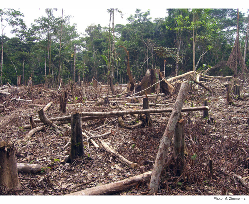

In the environmental sciences, we don't always want to understand current and past processes, sometimes we want to look into the future. For example, we may want to project how long it will take an endangered species to become extinct if threats continue. We may also want to project how populations or distributions will respond to continuing anthropogenic climate change. Predicting the future, or *forecasting* has the been the focus of a great deal of statistical research in the field of economics and we can apply the same techniques to ecological questions. Here we will focus on *time-series forecasting*, where we will use historical data collected over time to predict conditions in the future. We will use Rob Hyndman's [forecast](https://cran.r-project.org/web/packages/forecast/index.html) R-package.

```{r results='hide', message=FALSE, warning=FALSE}
library(forecast)
```

###Simple exponential smoothing models



Our first example will use annual rainforest loss (ha) in the in the Tocantins region of the Brazilian Amazon collected by satellite imagery over 25 years (data from [Global Forest Watch](http://data.globalforestwatch.org/) and analysed in further detail in [Virah-Sawmy *et al.* 2015](http://www.sciencedirect.com/science/article/pii/S2351989415000992)).

We will enter the data manually.

```{r}
Area <- c(1650,730,580,440,409,333,333,797,320,273,576,216,244,189,212,
        156,158,271,124,63,107,61,49,40,52)
Year <- c(1988:2012)
```

First, we use the `ts` function to create a time series object in R, specifying the data, the start and end times, and the frequency (in this case, one year). 

```{r}
Area_loss <- ts(Area, start = 1988, end = 2012, frequency = 1)
Area_loss
```

We can then split the data into training and test data using the `window` function. In this example, we will try to forecast rainforest loss for the last three years in the time series (2010-2012). These three years will be the test data, and the previous years the training data. In this way, we will be able to check our forecasted values against real observations. 

```{r}
Area_loss_train <- window(Area_loss, start = 1988, end = 2009, frequency = 1)
Area_loss_test <- window(Area_loss, start = 2010, end = 2012, frequency = 1)
```

Now that we have formatted our data appropriately, we will fit a simple exponential smoothing model using the `ets` function. This model uses a weighted average of past observations, with the weights decreasing exponentially into the past. This means that the most recent observations get the highest weight and therefore influence the predictions the most.

In the `ets` function, the model type is expressed as a three-character code representing the error type (first character), the trend type (second character) and the season type (third character). We will use the `model type = ANN` which is a simple exponential smoothing model with additive errors (A), no assumed trend (N) and no seasonality (N). 

```{r}
fit1 <- ets(Area_loss_train, model = "ANN")  
```

Now that we have fit the model using our training data (1988-2009), we can use the model to predict rainforest loss in the most recent 3 years (2010-2012), specifying `h` as the number of time points that we want to forecast (in this case 3 years).

```{r}
fit1_forecast <- forecast(fit1, h = 3) 
fit1_forecast
```

The output of our forecast gives us the forecasted values (Forecast) for each year (Point) and then the 80% and 95% confidence intervals. How did we do? By using the `plot` function on a *forecast* object, we can see a plot of the historical trend (line), with our forecast observations (blue points) and our confidence intervales (95% - grey shading, 80% - blue shading).

```{r}
plot(fit1_forecast) 
```

In this case, we already have historical data for our predicted points, so we will plot them on top using the `points` function (black squares), selecting the last three values in the Year and Area vectors (23:25). 

```{r}
plot(fit1_forecast) 
points(Year[23:25], Area[23:25], lty = 1, col = "black", lwd = 3, pch = 0)
legend("topright", legend = c("observed", "forecasted"), lwd = 3, 
       col = c("black","blue"), lty = c(0,0), merge = TRUE, 
       bty = "n", pch = c(0,19), cex = 1.3)
```

The value for alpha (the smoothing parameter) was estimated to be 0.7587, which means a relatively fast decay of observation weights into the past. In other words, the past observations have a relatively small influence on future predictions. 

From our figure we see a strong downward trend, so we could add an additive trend in the model. This is simply done by changing the second character in our model code to "A" (additive) and repeating the process. 

```{r}
fit2 <- ets(Area_loss_train, model = "AAN") 
fit2_forecast <- forecast(fit2, h = 3)
```

We can compare the simple exponential model with the model incorporating the additive trend by plotting them side by side.
```{r}
par(mfrow = c(1,2))

plot(fit1_forecast,main="Simple exponential model") 
points(Year[23:25], Area[23:25], lty = 1, col = "black", lwd = 4, pch = 0)

plot(fit2_forecast, main="Additive trend model")
points(Year[23:25], Area[23:25], lty = 1, col = "black", lwd = 4, pch = 0)

legend("topright", legend = c("observed", "forecasted"), lwd = 4, 
       col = c("black","blue"), lty = c(0,0), merge = TRUE, 
       bty = "n", pch=c(0,19), cex = 1.3)
```

Which model do you think performs better? Another option is to fit all possible models and select the best model using AIC. This is done simply by not specifying any model structure in the `ets` command. 

```{r}
fit3 <- ets(Area_loss_train)
fit3_forecast <- forecast(fit3, h = 3)
fit3$method
```

If you are interested in which model structure was selected you can extract it from the model object `fit_3$method`. In this case, the model structure was MNN: a model with multiplicative errors (M), but no overall trend (N) or seasonality (N) assumed. Now we can plot all three models to see which is giving us the best approximation of our observed measurements of rainforest loss.  

```{r}
par(mfrow = c(1,3))

plot(fit1_forecast, main="Simple exponential model") 
plot(fit2_forecast, main="Additive trend model")   
plot(fit3_forecast, main="Best model (lowest AIC)")  
points(Year[23:25], Area[23:25], lty = 1, col = "black", lwd = 4, pch = 0)

legend("topright", legend = c("observed", "forecasted"), lwd = 4, 
       col = c("black","blue"), lty = c(0,0), merge = TRUE, 
       bty = "n", pch = c(0,19), cex = 1.3)
```

We can also predict future rainforest loss (so no test data). Let's keep the prediction at three years but include all of our historical observations in the training data. We will again use the AIC model selection method. 

```{r}
Area_loss_train_2 <- window(Area_loss, start = 1988, end = 2012, frequency = 1)

fit4 <- ets(Area_loss_train_2)

fit4_forecast <- forecast(fit4, h = 3)

par(mfrow = c(1,1))

plot(fit4_forecast)
```

Bad news! The forecast is for decreasing rainforest area in the Amazon.
<br><br>

###Models incorporating seasonal variability
<br>
Let's try another example that incorporates not only long-term trends but also seasonal variability. We will use an example used in Rob Hyndman and George Athanasopoulos' [online textbook](https://www.otexts.org/fpp) and included in the *forecast* package: Australian monthly gas production. We will start by plotting the historical data from 1956 to 1995. If we plot the data, we can see two patterns: an overall positive trend and a zig-zagging seasonal pattern. 

```{r}
data(gas)

plot(gas)
```

If we use our first model, the simple exponential model that doesn't assume a trend or seasonality (*ANN*), we get the following when we are predicting the next 3 years. Note that `h` is now 36 time points (= 3 years x 12 months).

```{r}
fit_gas1 <- ets(gas, model = "ANN")

fit_gas1_forecast <- forecast(fit_gas1, h = 36)

plot(fit_gas1_forecast, main="Simple exponential model") 
```

As expected, we can see that the model does a pretty poor job of predicting the overall trend or the seasonal variability. In fact the model predicts constant gas production over the 3 years (or 36 monthly time steps). 

Now let's fit the model assuming additive seasonal varibility (*ANA*). 

```{r}
fit_gas2 <- ets(gas, model = "ANA")

fit_gas2_forecast <- forecast(fit_gas2, h = 36)

par(mfrow = c(1,2))

plot(fit_gas1_forecast, main="Simple exponential model") 
plot(fit_gas2_forecast, main="Seasonal trend model") 
```

This model looks a lot more convincing that the simple exponential fit. Finally, let's let the `ets` function choose the best model using AIC.

```{r}
fit_gas3 <- ets(gas)

fit_gas3_forecast <- forecast(fit_gas3, h = 36)

par(mfrow = c(1,3))
plot(fit_gas1_forecast, main="Simple exponential model") 
plot(fit_gas2_forecast, main="Seasonal trend model") 
plot(fit_gas3_forecast, main="Best model (lowest AIC)")
```
<br><br>

###Further help
<br>
Type `?forecast` for the R help with the package forecast.

For more details on the package and time-series forecasting in general, 
see Rob Hyndman and George Athanasopoulos' [online textbook](https://www.otexts.org/fpp). This script is based on the [Ecostats Research Blog post](http://eco-stats.blogspot.com.au/2015/07/forecasting-with-time-series-data.html) and BEES R User group meeting workshop by Jakub Stoklosa.

**Author**: Jakub Stoklosa & Rachel V. Blakey

Last updated:
```{r,echo=F}
date()
```
