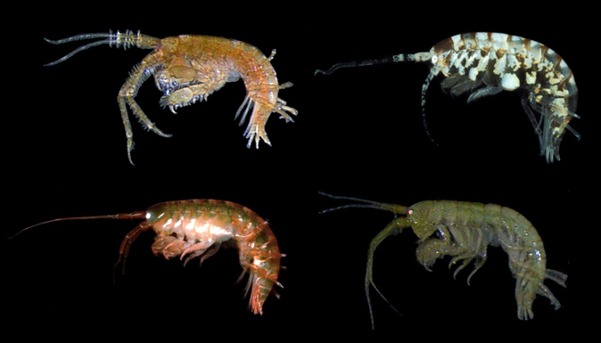

```{r, echo=FALSE}
# If instructor copy, use INST = TRUE to see inline code output.
library(knitr)
INST = FALSE

if (INST == TRUE) opts_chunk$set(fig.keep = 'all', results = 'markup', echo = TRUE)
if (INST == FALSE) opts_chunk$set(fig.keep = 'none', results = 'hide', echo = FALSE)

```



An evolutionary biologist was interested in body size-fecundity relationships in marine invertebrates. For most animals, larger females are able to produce more offspring per reproductive event. This is due to the levels of resources available for allocation to reproduction, and for species that brood their offspring, the physical constraints of housing the developing eggs or embryos.

Many crustaceans have indeterminate growth, which means they just keep on moulting and getting bigger until something kills them. Consequently, older and larger females can have many more offspring per reproductive event than smaller individuals. Amphipods are crustaceans that do not release their eggs into the plankton, but look after them in a brood pouch between their legs.

To explore how fecundity varied with body size, the biologist collected 40 females that were brooding eggs, measured their body length (mm) and the number of eggs in their brood pouch.


Load the data file "Amphipod.fecundity.csv" and choose a plot to visualise how egg number per brood.

```{r}
Amphipod.fecundity = read.csv(file = "Amphipod_fecundity.csv", header = T)
plot(Eggs~Length, data = Amphipod.fecundity,pch=16)
```


**A)** What analysis would you use to describe the relationship between body length and egg number per brood?

```{r}
# {1:MULTICHOICE:=linear regression~independent samples t test~goodness of fit test~paired t test}

```


Once you are satisfied you have met the assumptions, run the analysis. You should be able to answer the following questions


```{r}
lm1 = lm(Eggs~Length, data = Amphipod.fecundity)
plot(lm1)
abline(lm1)
```


**B)** What is the probability that there is no relationship between body size and body length?

```{r}
summary(lm1)
# {1:MULTICHOICE:=<0.001~0.001-0.01~0.01-0.1~>0.1}
```


**C)** How many more eggs are produced per brood for every 1 mm increase in body length?

```{r}
predict(lm1,list(Length=10))
# {1:NUMERICAL:=5.639:0.01}
```


**D)**  How many eggs would you predict that a 10 mm female would have?

```{r}
# {1:NUMERICAL:=31.25688:0.01}
```


**E)** What percentage of the variance in egg number per brood is explained by your relationship?
```{r}
# {1:NUMERICAL:=66.8:1}
```


