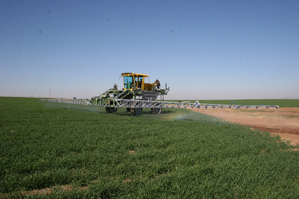

```{r, echo=FALSE}
# If instructor copy, use INST = TRUE to see inline code output.
library(knitr)
INST = TRUE

if (INST == TRUE) opts_chunk$set(fig.keep = 'all', results = 'markup', echo = TRUE)
if (INST == FALSE) opts_chunk$set(fig.keep = 'none', results = 'hide', echo = FALSE)

```



An agricultural scientist was testing the effects of a new insecticide on the growth of wheat. She hypothesised that removing insect pests would increase plant growth but was concerned that the compound may also be toxic to plants. She set up five plots in the field, each containing two plants. Within each plot, she applied the insecticide to one of the two plants and left the other untouched. After one month, the plants were harvested and the mass of wheat grains (g) recorded:

Plot  Insecticide added	No insecticide added
1	67	55
2	55	37
3	54	52
4	62	55
5	45	40


```{r}
wheat = read.csv(file = "Wheat.csv", header = T)
```

Firstly, visualise the differences in mass of wheat harvested in the two treatments.

```{r}
boxplot(Wheat.mass~Treatment, data = wheat)
```


**Q1** What statistical test could you use to detect whether the insecticide treatment affected the wheat harvest?


**Q2** After checking the assumptions of your test, conduct the test, and give the value of the test statistic and P value.

```{r}

t.test(Wheat.mass~Treatment, data = wheat, paired = TRUE)
insecticide = c(67,55,54,62,45)
control = c(55,37,52,55,40)

#or 

t.test(insecticide, control, paired = TRUE)

```

**Q3** Is there any evidence that the insecticide treatment affected the wheat harvest?

**Q4** Does this experimental design allow you to logically conclude that the insecticide is not toxic?
Yes, there was clearly a greater wheat harvest in the insecticide treatment
Yes, there was a significant effect of treatment in the statistical test
*No, the increased wheat harvest could be due to the removal of insects and be unrelated to the direct effect of the insecticide on wheat
No, the control plants were clearly healthy also

In a separate experiment, the scientist collected 100 leaves from plants that had been exposed to the insecticide, and counted those that displayed insect damage. She counted 14 damaged leaves and 86 complete leaves.


How does this differ from the 10% damage rate recorded when using other insecticides?

**Q5** What statistical test would be suitable to test the hypothesis that this frequency of damage differed from the previously recorded damage rate of 10% when using other insecticides?


**Q6** Present the value of the test statistic chosen and state whether the null hypothesis is rejected or retained

```{r}
chisq.test(x=c(14,86),p=c(0.1,0.9))

```


