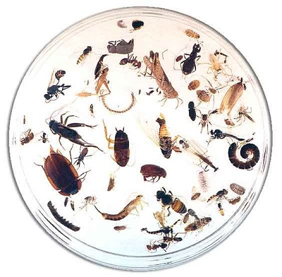

Data is the life-blood of science. As part of the scientific process, we invest an enormous amount of time collecting, analysing and presenting data. Before we can analyse data, however, we typically need to get it into a format that can be interpreted by others, and more importantly by the software used for analysis. Do this well and you can save yourself a lot of time; do this badly and you may end up wasting considerable time 'cleaning' and structuring the data to make it usable. 
<br><br>

### What should a data set look like?
<br>
Most data sets consist of rectangular tables of **values** (usually numbers or text). Each value belongs to a **variable** and an **observation**. A variable consists of values of the same type (e.g., temperature, duration or abundance). An observation consists of all values measured on the same unit (e.g., plot or individual). The convention is to store variables in columns and observations in rows.  



Here is an abridged data set from some insect sampling that shows you the desired format. It consists of five variables and data from  the first nine replicate observations. Note the first row consists of a **header** listing the names of each variable in each column. The variables are:

1. **Site**, with two possible values reflecting the habitat type (woodland or rainforest) 
2. **Method**, with two possible values reflecting the sampling technique (leaflitter or lighttrap)
3. **Insect**, with the possible values reflecting the type of insect (ant, beetle, springtail, wasp, moth or termite).
4. **Number**, with values reflecting the abundance of each insect in each observation.
5. **Group**, with one possible value reflecting the identity of the collector (A, B, C etc.)
<br>

```{r, echo = FALSE, results = 'asis'}
Insect = c("ant", "beetle", "springtail", "beetle", "wasp", "moth", "ant", "termite", "springtail")
Number = c(26,8,6,8,1,1,16,2,63)
Site = c("woodland", "woodland","woodland", "woodland", "woodland","woodland", "rainforest", "rainforest", "rainforest")
Method = c("leaflitter", "leaflitter", "leaflitter", "lighttrap","lighttrap","lighttrap", "leaflitter", "leaflitter", "leaflitter")
Group = c("A", "A", "A", "A", "A", "A", "A", "A", "A")
raw_dat = data.frame(Site, Method, Insect, Number, Group)
```

```{r,echo=FALSE}
raw_dat
```
<br>

This table is structured so that new data can be added with ease. For instance, we may wish to combine the data for multiple 'collecting groups', in which case it is straight-forward to add news rows to the existing dataset.  If an additional set of samples has new insect species, we do not need to add new columns for each new species, just new values for the Insect variable. This is known as a long format. Some analyses (e.g., contrasts of species composition) will require each species as a separate column. See our [Reshaping data](http://environmentalcomputing.net/Reshaping-data/) for help on swapping between long and wide formats.
<br><br>

### 6 Golden rules of data entry
<br>
**1.** Each column should contain only one type of information (i.e., text, numbers, dates, boolean). For instance, if text is inserted within or below the dataset, R or other analysis software will try to interpret the text as a **value** in the corresponding column. Similarly, if summary text is provided above the data (a common mistake), this will be interpreted as the first line or header of the actual data.  

**2.** Extensive metadata (e.g., site descriptions) should usually be documented in a separate file, but if sufficiently brief it can useful to include this information in its own column in the data table.  

**3.** Only use ASCII characters (upper and lower case English letters, numbers and common punctuation marks) for file names, variable names, and data values. 

**4.** Although it won't affect analyses, to aid with visualisation of the raw data, it is good practise to order fixed variables first, followed by measured variables. In Table 1, **Site** and **Method** are fixed in that we know them in advance of data collection, whereas **Insect** and **Number** are measured. This, however, is not a hard and fast rule. For instance, we may want to order **Group** last as this information will typically be treated as metadata rather than data of actual interest for the analysis.

**5.** Do not manipulate the raw data once digitized. Ideally the raw data should be treated as 'read-only' and any further transformations or manipulations should be done using saved R scripts (or an alternative programming language). This avoids accidentally inserting errors into the raw data each time you want to tweak something.

**6.** Finally, always store data as <font face="monospace">.csv</font> or <font face="monospace">.txt</font> **NOT** <font face="monospace">.xls</font>, <font face="monospace">.xlsx</font> or other proprietary formats as those cannot be easily read into R or shared with collaborators. Text files do not require specific software to be read.
<br><br>

### Further help
<br>
Once your data is entered in .csv or .txt format, see [Importing data](http://environmentalcomputing.net/Importing-data/) for help on importing into R.

<p style="margin-left:.5in;text-indent:-.5in">Borer, ET, EW Seabloom, MB Jones & M Schildhauer. 2009. Some simple guidelines for effective data management. *Bulletin of the Ecological Society of America*, 90: 205-214. [link](http://dx.doi.org/10.1890/0012-9623-90.2.205)</p>

<p style="margin-left:.5in;text-indent:-.5in">Wickham, H. 2014. Tidy data. *Journal of Statistical Software*, 59:(10). [link](http://www.jstatsoft.org/v59/i10/paper)</p>
<br><br>

**Author**: Andrew Letten
<br>
Last updated:
```{r,echo=F}
date()
```