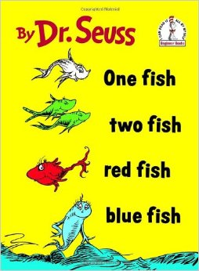

Learning how to format data is an essential skill to allow you to easily produce figures and run analyses. You should always aim for data that are formatted with each observation as a row and each variable as a column (see Data entry module). For some types of variables, however, there are choices to be made about how you input the data.

For example, it is very common in the biological sciences that we record the abundance of many species of organisms from each of our replicate observations (transects, quadrats, surveys etc). We then have two choices for how to input that data:  
1. a separate column for every species that records its abundance, or,  
2. two columns - one that identifies the species and one that records the abundance.



Consider a data set that recorded the abundance of fish from each of three transects that were set up on two reefs in two separate months. First, import this sample data set, [ReefFish.csv](http://environmentalcomputing.net/wp-content/uploads/2016/05/ReefFish.csv), to see the way it is formatted.

```{r}
ReefFish <- read.csv(file="ReefFish.csv", header =T)
```

```{r,echo =F}
head(ReefFish)
```

This data frame is arranged in a **long format** with one variable that identifies the fish species, and one variable that holds the abundance data. The other three variables identify each transect (Site, Month and Transect),

This format is efficient for data entry as you only need to have rows for the species that were present in that particular transect, and don't have to keep adding columns every time a new species is recorded. You would need the data in this format if you wanted to use a plot to contrast the abundance of fish among the three species.

If, however, you would like to contrast the abundance of one of the species or calculate the total abundance per transect, the data will need to be manipulated in some way.

Fortunately, there are some very handy packages in R that make this possible. If you have ever used pivot tables in Excel, they are doing similar things.
<br><br>

### Reshaping from long to wide format
<br>
In this example, we will use the package [reshape2](https://cran.r-project.org/web/packages/reshape2/) to convert this data frame to a **wide format** that will allow further data exploration. First, install and load the package.

```{r,warning=F}
library(reshape2)
```

To convert this data set into a wide format with a separate column for each fish species, we use the function `dcast`.

```{r}
ReefFish.wide <- dcast(ReefFish,
                      Site + Month + Transect ~ Species,
                      value.var = "Abundance", fill = 0)
```

The arguments of `dcast` are:  
* The data frame you would like to convert (in this case, ReefFish)  
* The variable(s) you would like to include unchanged as columns in the new data frame are to the left of the ~ (Site, Month and Transect)  
* The variable(s) that is being converted to new columns are to the right of the ~ (in this case, Species)  
* The variable that holds the values that will fill in the new columns (specified by `value.var`, in this case, Abundance.  
* `fill=0` tells `dcast` to fill in zeroes for when a species was missing from a given transect.


```{r,echo =F}
head(ReefFish.wide)
```

Note that the wide format of this data now has a column for each species with all the abundance values. You would get as many columns as you had unique labels in the Species column. You get as many rows as you have unique combinations of the variables that are not being split up (Site, Month and Transect in this example).

You can now plot or analyse any single species against possible predictor variables of Site or Month. Multivariate analyses of species composition against possible predictor variables also need each of the species to be in separate columns.

*Note that if you had a transect with no fish observations, you would need to add a row to the original data set, perhaps with a species code of "none". If you didn't, that replicate observation would be missing from the wide format - needed if you want to contrast abundance across reefs etc.
<br><br>

### Summarising data as you reshape from long to wide
<br>
In the above example, there was only one row that belonged to each combination of Site, Month and Transect. If there are duplicate rows for each combination of the variables that you want to keep in the new data frame (the ones to the left of the ~) you need to tell `dcast` how you would like to deal with the duplicates (e.g., add them up or calculate their mean)

For example, if we wanted to pool the transects from each survey, we could remove Transect from the list of variables to include in the new data frame and add an argument (`fun.aggregate = sum`) to tell `dcast` that we would like to add up the values from the three transects in each Site/Month combination. 

```{r}
ReefFish.wide2 <- dcast(ReefFish,
                       Site + Month ~ Species,
                       value.var = "Abundance", fun.aggregate = sum, fill = 0)
```


```{r,echo =F}
head(ReefFish.wide2)
```

If we wanted the mean of the three transects, we can use `fun.aggregate = mean`).

```{r}
ReefFish.wide3 <- dcast(ReefFish,
                       Site + Month ~ Species,
                       value.var = "Abundance", fun.aggregate = mean, fill = 0)
```

You can also put more complex expressions in the reshape formula to create new variables that are combinations of old ones. For example, you could create a new column for each of the combinations of Species and Month by adding both variables to the right of the ~

```{r}
ReefFish.wide4 <- dcast(ReefFish,
                       Site + Transect ~ Species + Month,
                       value.var = "Abundance", fill = 0)
```

```{r,echo =F}
head(ReefFish.wide4[,1-4])
```
<br><br>


### Reshaping from wide to long format
<br>

The function `melt` will convert data from the wide format to a long format.

Here, we can use this to get our original data set back from the wide format data sets we just made.

```{r}
ReefFish.long <- melt(ReefFish.wide,
                    id.vars = c("Site","Month","Transect"),
                    measure.vars = c("RedFish","BlueFish","BlackFish"),
                    variable.name = "Species", value.name = "Abundance")
```

```{r,echo =F}
head(ReefFish.long)
```

The arguments of <font face="monospace">melt</font> are:  
* The data frame that we would like to convert  
* `id.vars`> specifies the columns that remain unchanged (here the predictor variables that label each replicate observation)  
* `measure.vars` specifies which variables hold the data that will go into the new column  
* `variable.name` provides the name of the new column.  

We have now recreated our original data set. The only difference is that species that were absent from a given transect have their own row with an abundance value of zero.
<br><br>

### Further help
<br>
Type `?reshape2` to get the R help for this package.

[An introduction to reshape2](http://seananderson.ca/2013/10/19/reshape.html)
<br><br>

**Author**: Alistair Poore
<br>
Last updated:
```{r,echo=F}
date()
```