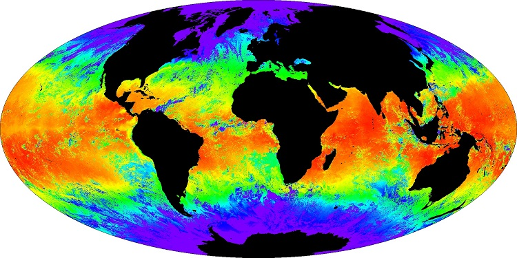

Network Common Data Form (NetCDF) is a machine-independent file format commonly used to store multi-dimensional data for scientific use. Sometimes dealing with NetCDF files is unnecessarily difficult, and even more difficult if you are a new user. 

This worked example will show you how to open, view and extract data from a NetCDF file in R. These files can have multiple dimensions (e.g., latitude, longitude, time, depth, altitude) as well as multiple variables (e.g., temperature, rainfall, habitat cover, chlorophyll-a), and hence require special formatting structure.

The sample data set used below is extracted from the [Integrated Marine Observing System (IMOS)](http://imos.org.au/) and is the sea surface temperature (SST) for the east coast of Australia on 6/12/15. While this example is aquatic, the application to terrestrial domains is the same. 


<br><br>

### Install packages and load sample data file
<br>
Firstly, install and load the packages [ncdf4](https://cran.r-project.org/web/packages/ncdf4/index.html), needed to read, write, and create netCDF files and [raster](https://cran.r-project.org/web/packages/raster/index.html), which provides functions for manipulating geographic data in 'raster' format (i.e., divided up into cells of equal size).

```{r,warning=FALSE,message=FALSE}
library(ncdf4)
library(raster)
```

Download and import the [sample data file](https://www.dropbox.com/s/hvv08419l7hs81v/2015_20151206092000-ABOM-L3S_GHRSST-SSTfnd-AVHRR_D-1d_dn-v02.nc?dl=0) (make sure to close it when you are done, see below).

```{r}
SST_data <- nc_open("2015_20151206092000-ABOM-L3S_GHRSST-SSTfnd-AVHRR_D-1d_dn-v02.nc")
```

Use `print` to examine the structure of the data and what the NetCDF file contains. Each NetCDF file is coded by an individual which means that files from different sources may be coded differently. Make sure you pay attention to the global attributes of the files so that you can better understand the data structure and format. 

```{r}
print(SST_data)
```

The first few lines of output will tell you the variables contained in the file and the dimensions at which they are stored. Here, we see that there is one variable (sea surface temperature) with 3 dimensions (time, latitude and longitude). 

You can check the units of each variable with `ncatt_get`.

```{r,eval=FALSE}
ncatt_get(SST_data,"time","units")
ncatt_get(SST_data,"sea_surface_temperature","units")
```

These data can be assigned to new objects with the function `ncvar_get`.

```{r}
temp <- ncvar_get(SST_data,"sea_surface_temperature")
lat <- ncvar_get(SST_data,"lat")
lon <- ncvar_get(SST_data,"lon")
time <- ncvar_get(SST_data, "time")
```

You can check the dimensions of each with `dim`.

```{r,eval=FALSE}
dim(temp)
dim(time)
dim(lat)
dim(lon)
```

You will see that the variable 'temp' is a large matrix, with dimensions equal to lat and lon. 

The dimension of the time variable is one. This is because this example data set is only from one time step, with time equal to the number of seconds since 1981-01-01 00:00:00. When you have more than one time step it is critical to determine what year-month-day etc. the data comes from. 

In this example, the time origin is in both date and time format so the following code is needed to determine the time value:

```{r,eval=FALSE}
as.POSIXct(time,origin="1981-01-01 00:00:00")
```

Close the file.

```{r,eval=FALSE}
nc_close(SST_data)
```
<br><br>

### Plotting the data
<br>
Before you try using the SST data held in 'temp', try plotting the data to see if it looks sensible. For a quick and simple plot, convert 'temp' to a raster and plot this object.

```{r}
raster_temp <- raster(temp)
plot(raster_temp)
```

This doesn't look like the east coast of Australia - try transforming.

```{r}
raster_temp <- t(raster_temp)
plot(raster_temp)
```

The white patchiness in the sea surface temperature image is cloud cover and land cover. It can be improved by using composites over greater periods of time. 

Now that the data looks sensible, we can index the matrix to select smaller areas of interest. Because we know the dimensions of the matrix we can index to certain areas. For example, to select the data that is off the coast of NSW only, we can limit the latitudes to those between 27 degrees S (Qld border) and 38 degrees S (Vic border). 

Testing which numbers are less than -27 tells us that 1:350 are further south than 27 degrees S:

```{r,eval=FALSE}
lat <=(-27)
```

Testing which numbers are greater than -38 tells us that 1:900 are further north than 38 degrees S:
```{r,eval=FALSE}
lat>=(-38)
```

Our desired latitudinal range is therefore 351:859. We can then use indexing of the temp matrix to make a new one with just the NSW latitudes, and plot again.

```{r}
temp_NSW <- temp[,351:859]
plot(t(raster(temp_NSW)))
```
<br><br>

### Converting the matrix to a dataframe
<br>
At this point you may wish to continue using the data in matrix format. However, some applications require the data is converted from a matrix to a dataframe. Here, we will convert the matrix of 'temp' to a dataframe with three columns for lat, long and temp. 

First, we identify the x and y dimensions so that we can specify the size of the data frame. These are the latitudes and longitude values that will be the column and row names.

```{r}
dimnames <- list(lon,lat) #identify the x and y dimensions
```

Next, we combine temperature, lat and long into a new matrix and convert to a data frame.

```{r}
temp_mat <- matrix(temp, ncol=1251, nrow=1001, dimnames=dimnames) 
SST_data_2 <- as.data.frame(as.table(temp_mat))
```

Next, we add the column names.

```{r}
colnames(SST_data_2) <- c("Lon", "Lat", "Temp")
```

Finally, with the temperature units being in Kelvin, it is more useful to convert these to Celcius with a simple calculation.

```{r,eval=FALSE}
SST_data_2$Temp_cel <- SST_data_2$Temp - 273.15
```

This example shows you the basics of opening a NetCDF file and extracting the information. If you have multiple NetCDF files that you need to extract from, then you can simply set up the script above in a loop.
<br><br>

### Model prediction
<br>
NetCDF files are commonly used in model prediction. For example you may want to predict the distribution of an animal given certain environmental conditions. You can make model predictions on a raster (see `?predict` in the raster package) or you can make predictions on the data frame (see `?predict in the stats package). The model object for each predict function is typically a standard model object (lm, glm, gam etc.)
<br><br>

### Further help
<br>
There are many help options for NetCDF files online. Please be aware that there are high and low level functions and packages for dealing with NetCDF files. Here we have only dealt with low level functions but the high level functions will give you control over editing, re-writing, and re-shaping NetCDF files. 

Help for [Opening NetCDF files](https://help.aodn.org.au/aodn-data-tools/user-code-library) from IMOS (Matlab, R and Python).

If you are unsure of which file you want/need from online then you can use a viewing program from NASA [Panoply](http://www.giss.nasa.gov/tools/panoply/) to view the files. 
<br><br>

**Author**: Stephanie Brodie
<br>

**Year:** 2018

**Last updated:** `r format(Sys.time(), "%b %Y")``

