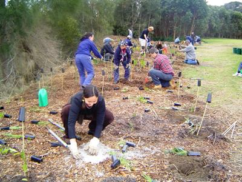

```{r, echo=FALSE}
# If instructor copy, use INST = TRUE to see inline code output.
library(knitr)
INST = TRUE

if (INST == TRUE) opts_chunk$set(fig.keep = 'all', results = 'markup', echo = TRUE)
if (INST == FALSE) opts_chunk$set(fig.keep = 'none', results = 'hide', echo = FALSE)

```



An environmental scientist was testing the effectiveness of a bush regeneration program. At ten sites, a fixed 10 x 10 m plot was censused before and after the regeneration efforts. In each census all plant species were recorded and the percentage of weed species calculated. The following data were obtained.

Site  Before	After
1	45	35
2	37	38
3	23	20
4	12	11
5	38	25
6	24	12
7	18	22
8	5	8
9	27	28
10	8	12


```{r}
bushregen = read.csv(file = "Bush_regen.csv", header = T)
```

Firstly, visualise the differences in weed diversity in the sites before and after the regeneration program.

```{r}
boxplot(Weeds~Time, data = bushregen)
```


**Q1** What statistical test could you use to detect whether the regeneration efforts affected the percentage of weed species found per site?


**Q2** After checking the assumptions of your test, conduct the test, and give the value of the test statistic and P value.

```{r}

t.test(Weeds~Time, data = bushregen, paired = TRUE)

```

**Q3** Does your test support the proposition that money spent on bush regeneration at these sites is an effective way to control weeds?

**Q4** What aspects of the sampling design could be improved to increase the statistical power to detect differences between the plots before and after the bush regeneration program?