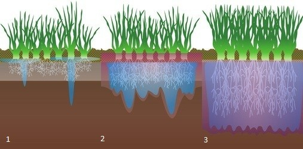

```{r, echo=FALSE}
# If instructor copy, use INST = TRUE to see inline code output.
library(knitr)
INST = TRUE

if (INST == TRUE) opts_chunk$set(fig.keep = 'all', results = 'markup', echo = TRUE)
if (INST == FALSE) opts_chunk$set(fig.keep = 'none', results = 'hide', echo = FALSE)

```




An agricultural scientist was testing the effects of a new chemical wetting agent aimed at improving soil moisture at a farm with several different soil types. He collected soil from eight locations and brought the samples back to laboratory.

From each soil sample, 10 g of the soil was treated with the wetting agent and 10 g left untouched. All samples were then weighed, wet with a constant volume of water, allowed to dry for 24 hours and then reweighed. He obtained the following data on the final weights of the samples:

Location  Treated (g)	Control (g)
1	25.2	13.1
2	17.8	14.8
3	32.5	11.5
4	23.1	16.0
5	18.2	18.0
6	24.9	20.1
7	19.6	14.4
8	22.3	18.6


```{r}
soil.wetting = read.csv(file = "Soil_wetting.csv", header = T)
```

Firstly, visualise the differences in mass of soil in the two treatments.

```{r}
boxplot(Mass~Treatment, data = soil.wetting)
```


**Q1** What statistical test could you use to detect whether the wetting agent had an effect on the moisture retention of the soil?


**Q2** After checking the assumptions of your test, conduct the test, and give the value of the test statistic and P value.

```{r}

t.test(Mass~Treatment, data = soil.wetting, paired = TRUE)

```


**Q3** Discuss whether this sampling design was appropriate given that the farm contained several different soil types? If there were only two soil types, describe a sampling program that would effectively test the hypothesis that the wetting agent improved soil moisture. With reasons, state which statistical test would be appropriate for your sampling design?