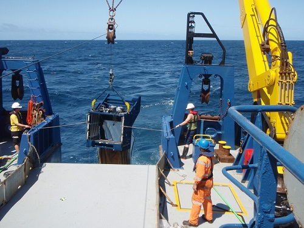

As field scientists, we often need to provide a map of our study sites for inclusion in publications and presentations. This tutorial provides a simple and straightforward method of creating accurate maps from freely available shapefiles without all of the jumble and text that is often associated with [maps created from Google Maps](http://environmentalcomputing.net/making-simple-maps/) or Google Earth. 

Shapefiles of many parts of the world are usually available online. With enough searching you can usually find them for free. This script would work for any region of the world if you can locate a corresponding shapefile for that region.



This example uses a set of coastline shapefiles freely available from [Geoscience Australia](http://www.ga.gov.au/) to create a map of sampling sites off the coast in eastern Australia. 

Start by loading in the latitude and longitude of your study sites (in decimal degrees). For this example, download the data for eight sites in [point_data.csv](http://environmentalcomputing.net/wp-content/uploads/2018/03/point_data.csv) and import into R

```{r}
Sites <- read.csv("point_data.csv")
```

Picture you have a set of coordinates of sampling locations throughout your study area. Your map needs to include these locations but it is also desirable to have a buffer of space around these points so that the geography of the area can be easily visualised. For this, we can specify a bounding box based on your point locations and include a buffer around the edges of this box to expand the map area.

Specify your buffer size (in decimal degrees) around bounding box of data points that you desire for your data. You can play around with this value later until you find a suitable scale.

```{r}
buffer <- 0.11
```

Then by using the minimum and maximum latitude and longitude of your sampling points, you can specify the coordinates of the bounding box limits with the buffer included. 

We will code this string as "geo_bounds".

```{r}
geo_bounds <- c(left = min(Sites$long)-buffer, 
                bottom = min(Sites$lat)-buffer, 
                right = max(Sites$long)+buffer, 
                top = max(Sites$lat)+buffer)
```

Alternatively, if you would like to manually select bounds for your map, you can enter them like this:

```{r, eval=F}
min_long <- 150.1
max_long <- 150.4
min_lat <- -36.5
max_lat <- -36.3

geo_bounds <- c(left = min_long, bottom = min_lat, right = max_long, top = max_lat)
```

Now create a dataframe containing the coordinates of the four corners of our bounding box by expanding the grid to all possible combinations of our geo_bounds values (i.e. every unique combination of latitude and longitude from "geo_bounds").

```{r}
Sites.grid <- expand.grid(long_bound = c(geo_bounds[1], geo_bounds[3]), 
                       lat_bound = c(geo_bounds[2], geo_bounds[4]))
```

Next you'll need to tell R that Sites.grid is a spatial points dataframe by pointing it in the direction of the coordinates of the bounding box. Once you have done this, R will recognise Sites.grid as spatial data with "lon_bound" representing x and "lat_bound" representing y.

First, you will need to install and load the [sp](https://cran.r-project.org/web/packages/sp/index.html) package for handling spatial data.

```{r, include=F}
library(sp)
```

The function `coordinates` will then convert the data ram into a spatial object.

```{r}
coordinates(Sites.grid) <- ~ long_bound + lat_bound
```

Download the GEODATA COAST 100K 2004 shapefiles available from [here](https://data.gov.au/dataset/geodata-coast-100k-2004/resource/455ee5c6-2862-445e-8fbe-604476926b4c). Then unzip the downloaded file to a folder and place it inside your R session working directory.

To load the shapefile into R, you will need to install and load a package called [rgdal](https://cran.r-project.org/web/packages/rgdal/index.html).

```{r, include=F}
library(rgdal)
```

A shapefile can contain three basic types of information. The simplest is point data, with the coordinate addresses of points in latitude and longitude format. Shapefiles can also contain information on which of these points are connected by lines. This is called line data. And finally, sometimes these line connections form enclosed shapes or polygons. 

The shapefile we are working with is polygon data. Polygon data is useful for our purposes because R can recognise that shapes are enclosed and fill them with any colour you like. Line data cannot do this as R cannot recognise which shapes are actually enclosed. All three types of data are included in the various shapefiles included in the package downloaded from Geoscience Australia and you can experiment with them all in R.  

We use `readOGR` to read in the shapefile for the Australian coast and name it Aus in our environment. The argument `dsn` provides the path to the folder holding the shape files, while `layer` identifies which file we want. In this case "castauscd_r" holds the coastline data for Australia as a polygon). Page 9 of the pdf user guide that was downloaded in the zip file explains what all the other files are. 

```{r}
Aus <- readOGR(dsn = "61395_shp/australia",layer = "cstauscd_r")
```

Alternatively, for faster loading you can load the shapefiles for individual states in the subdirectories of the downloaded folder. 

If you examine the R Environment, you can see that R has stored the shapefile in memory as a SpatialPolygonsDataFrame, which sounds a lot like the class of our Sites.grid. This means that R has automatically recognised that this is spatial data and has a coordinate system associated with it.

Plot the shapefile in R so we can confirm that it loaded properly.

```{r}
plot(Aus)
```

You can see that R has plotted the shape of the Australian coastline but with some additional data that we might not want in our completed map. We can query the shapefile like we would a dataframe to see if there are any variables we can subset to get a less cluttered map.

```{r}
summary(Aus)
```

"FEAT_CODE" looks like a factor with three variables: "island", "mainland" and "sea", which we may be able to subset to achieve our desired outcome. In this case we'd like to eliminate the polygons in the sea as they are not useful to us so we subset the shapefile to remove this feature code and plot to see the result.  

```{r}
Aus_coast <- subset(Aus, FEAT_CODE != "sea")
plot(Aus_coast)
```

Now that we have eliminated the unwanted lines from our shapefile, we can proceed to subset it to the same spatial extent as our bounding box from earlier, "Sites.grid". 

We do this with the function `crop` from the [raster](https://cran.r-project.org/web/packages/raster/index.html) package. First, install and load this package.

```{r}
library(raster)
```

Then use `crop` to define the spatial extent.

```{r}
Aus_crop <- crop(Aus_coast, extent(Sites.grid))
```

Finally, plot the output to ensure everything worked and you have the section of coastline you are looking for. If you are not happy with the extent of the map, you can go back earlier in the code and change the coordinates of your "geo_bounds" string.

```{r}
plot(Aus_crop)
```

Now that we are happy with the extent of our map, we can plot the polygon and our point data (i.e., the sampling sites) in [ggplot](http://ggplot2.tidyverse.org/reference/).

```{r}
library(ggplot2)
```


```{r}
ggplot() + 
  geom_polygon(data = Aus_crop, aes(x=long, y=lat, group=group), fill="forestgreen", colour="black") +
  coord_equal() +
  
  geom_point(data=Sites, aes(x=long, y=lat), colour="red") +
  
  geom_text(data = Sites, 
            aes(x=long+0.01, y=lat, label = Site),
            size = 3,
            hjust = "left") +
  
  labs(x="Longitude", y="Latitude") +
  theme_classic()
```


the `geom_polygon` plots the map, the `geom_points` adds a point at the latitude and longitude of each sampling site, and if desired, you can use `geom_text` to add labels next to each site. Note that I added a tiny amount (0.01) to the longitude to stop the labels appearing on top of the points.

**Author**: Matt Holland

**Year:** 2018

**Last updated:** `r format(Sys.time(), "%b %Y")``


