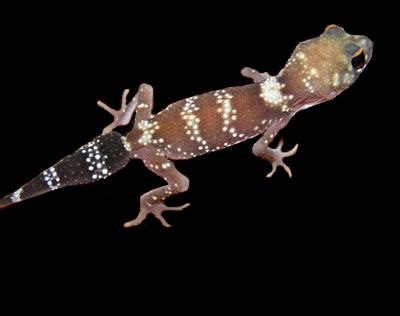

```{r, echo=FALSE}
# If instructor copy, use INST = TRUE to see inline code output.
library(knitr)
INST = TRUE

if (INST == TRUE) opts_chunk$set(fig.keep = 'all', results = 'markup', echo = TRUE)
if (INST == FALSE) opts_chunk$set(fig.keep = 'none', results = 'hide', echo = FALSE)

```



An ecologist wishes to know if there are differences in habitat preference between four species of lizard. She constructs a series of arenas 1 m by 1 m and places three habitat types over an equal area: sand, leaf litter, and rock. She then returns 24 hours later and notes which habitat the lizard is in. Only one lizard is used in an arena at a time, and there are 45 trials run on different individuals from each species. The number of individuals found in each habitat is as follows:

Sand	Leaf litter	Rock
House gecko	8	19	18
Barking gecko	7	16	22
Snow skink	18	15	12
Water skink	24	15	6


**Q1** How would you test the null hypothesis "the choice of habitat type is independent of species"?


**Q2** Conduct the test, and give the value of the test statistic and P value.

```{r}
lizard = matrix(c(8,7,18,24,19,16,15,15,18,22,12,6), nrow=4, dimnames = list(c("House gecko", "Barking gecko", "Snow skink", "Water skink"), c("Sand", "Leaf litter", "Rock")))
lizard
chisq.test(lizard, correct = F)
```


**Q3** Which combination of lizard species and habitat type show the greatest deviation from that expected under the null hypothesis of no association between species and habitat type?

```{r}
chisq.test(lizard, correct = F)$residuals
```

