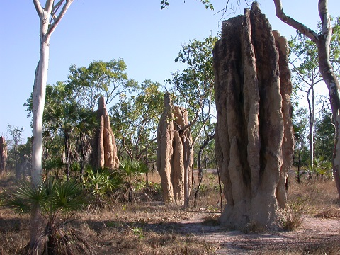

```{r, echo=FALSE}
# If instructor copy, use INST = TRUE to see inline code output.
library(knitr)
INST = TRUE

if (INST == TRUE) opts_chunk$set(fig.keep = 'all', results = 'markup', echo = TRUE)
if (INST == FALSE) opts_chunk$set(fig.keep = 'none', results = 'hide', echo = FALSE)

```



A study by CSIRO demonstrated the soil in termite mounds could be used as an indicator of gold in local landscapes. Testing this approach, a team of geochemists counted the number of soil samples from termite mounds that contained trace amounts of gold and the number lacking any evidence of gold. They obtained the following data from her collection of samples from both Western Australia and the Northern Territory.


Gold in sample  Western Australia	Northern Territory
Contains gold	15	14
None	39	32

**Q1**	What statistical test could you use to test the hypothesis that the proportion of samples containing gold differed between Western Australia and Northern Territory?


**Q2** Conduct the test, and give the value of the test statistic and P value


```{r}
gold = matrix(c(15,39,14,32), nrow=2, dimnames = list(c("Contains gold", "No gold found"), c("Western Australia", "Northern Territory")))
gold                                                                                           

chisq.test(gold, correct = F)
```


**Q3**	A researcher in the Northern Territory was convinced that the species of termites in his area were more likely to have gold in their mounds than those found in other areas. With reasons, discuss whether your test supports this conclusion, and whether your test could be used to argue that gold deposits are more frequent in the Northern Territory

