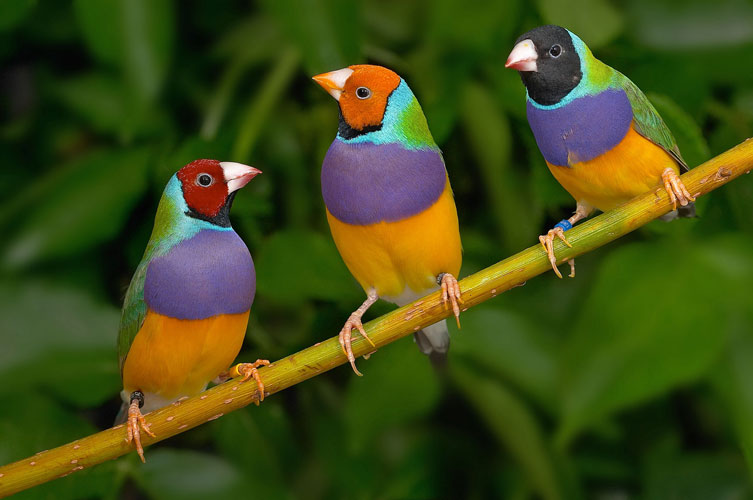

```{r, echo=FALSE}
# If instructor copy, use INST = TRUE to see inline code output.
library(knitr)
INST = TRUE

if (INST == TRUE) opts_chunk$set(fig.keep = 'all', results = 'markup', echo = TRUE)
if (INST == FALSE) opts_chunk$set(fig.keep = 'none', results = 'hide', echo = FALSE)

```



A behavioural ecologist was studying Gouldian Finches. They occur in three colour morphs with yellow, red and black faces. The black faced morph is common (70% of individuals in the wild), the red morph (moderately common, 29%) and the yellow morph rare (1%). As the finches are an endangered species, she used individuals sourced from captive populations in her experiments and needed to test whether the colour morphs were in similar proportions as the field populations. Her captive population had 150 birds: 96 black, 49 red, and 5 yellow faced.

**Q1**  What are the expected numbers of each colour morph in her captive population if they were in the same proportions as the wild population?

Black:
Red:
Yellow:

```{r, warning = FALSE}
chisq.test(x = c(96,49,5), p = c(0.7,0.29,0.01))$expected

```


Choose the appropriate statistical analysis, and test whether the captive population differed from the wild one.

**Q2**  What is your value of the test statistic and associated P value?

```{r, warning = FALSE}
chisq.test(x = c(96,49,5), p = c(0.7,0.29,0.01))

```

**Q3**  Do the captive-bred birds have colour morphs in similar proportions to the wild populations?

**Q4** If not, which colours are over or under represented in the captive sample.

Black:
Red:
Yellow:

```{r, warning = FALSE}
chisq.test(x = c(96,49,5), p = c(0.7,0.29,0.01))$residuals

```


