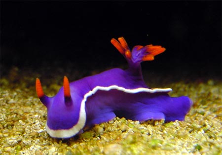

```{r, echo=FALSE}
# If instructor copy, use INST = TRUE to see inline code output.
library(knitr)
INST = TRUE

if (INST == TRUE) opts_chunk$set(fig.keep = 'all', results = 'markup', echo = TRUE)
if (INST == FALSE) opts_chunk$set(fig.keep = 'none', results = 'hide', echo = FALSE)

```



Many animals defend themselves from predation by producing toxins. Others can gain some protection by having a lower nutritional content than co-occurring prey. To test how nutrients and toxins interact to determine food choice in predatory fish, a behavioural ecologist ran 40 trials, each offering an individual fish a choice of four diets.

The artificial diets were: 1) a control diet that matched their usual prey, 2) a diet with additional nutrients, 3) a diet with a toxin added (from an abundant sea slug) and 4) a diet with both nutrients and toxins added. After each trial, the ecologist recorded which diet was first selected, and obtained the following data on number of times each diet was selected:

**Treatment**
Control, 12
Nutrients	added, 18
Toxins added, 6
Nutrients and toxins added, 4


**Q1**  What statistical test could you use to test the hypothesis that diet selection by the fish varied among the four diets?


**Q2**  Conduct the test, and give the value of the test statistic and P value.

```{r, warning = FALSE}
chisq.test(x = c(12,18,6,4), p = c(0.25,0.25,0.25,0.25))

```

**Q3**  In the experiment described above, the ecologist used 40 separate fish, with each individual fish used for one trial only. He also wanted to test the same hypothesis with a different species of fish, but only had four individuals of the second species. Describe an experimental design to test the same hypothesis with the second species. How could that design be analysed?  