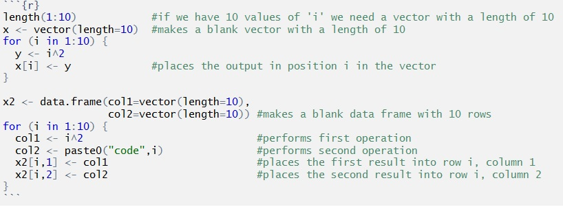

You might think having skills in computer coding is just for web site and game developers, but skills in coding are increasing valuable for environmental scientists. Running your data analyses and graphics using code means that your research methods are explicitly saved, reproducible and easily shared with colleagues or supervisors.

On these pages, we give some advice for writing effective code and some of the very useful coding skills that will save you lots of time.

* [Good practice for writing scripts](http:environmentalcomputing.net/Good-practice-for-writing-scripts/)
* [Writing simple functions](http://environmentalcomputing.net/Writing-simple-functions/)  
* [Using loops](http://environmentalcomputing.net/Using-oops/)
* Using Lists...coming soon
* Logical control...coming soon
* [Version control](http://environmentalcomputing.net/version-control/)



**Author**: Alistair Poore & Will Cornwell

Last updated:
```{r,echo=F}
date()
```
