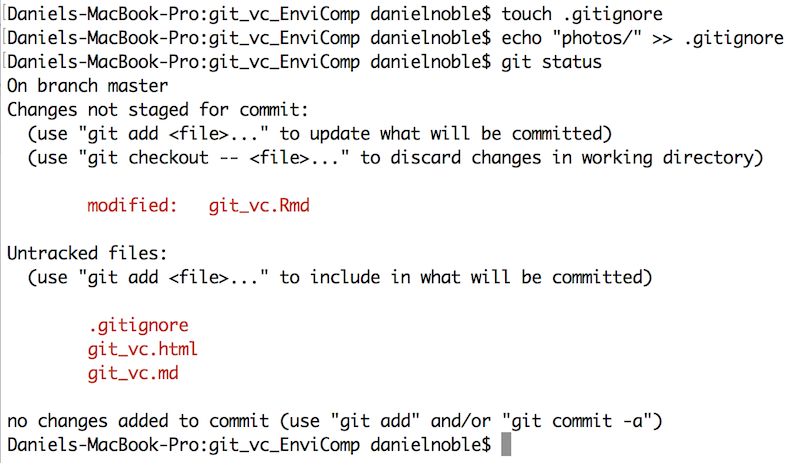

### Advantages, disadvantages and solutions
 
Fundamental to project organization is maintaining a consistent, uniform and simple set of working files that can be understood by your future self, collaborators and interested folks wanting to reproduce your analyses or re-use code or your data. However, for complex projects with many collaborators maintaining tidiness and keeping track of changing files can be very challenging!

While file sharing services like Dropbox are easy to use and can maintain a consistent file set on your computer(s) and/or among collaborators, it has some serious disadvantages. Specifically, it can't tell you what has changed within files. It also can't deal with conflicts between files when you and your collaborators are working at the same time on the same things. This often leads to a build up of files that no one seems to know what are for or how they differ. Its limited capacity for tracking deleted files also leads to a build up of "too afraid to delete" files. As projects develop, theses become papers and go through countless rounds of revisions. A little bit of organizing can keep chaos from compounding and maintain reproducibility (for both you and others) through all the changes.   

Ideally, it would be nice to easily see the current (and hopefully best) set of files, but be able to see who has changed them and what specific parts of the files have been modified. Keeping a record of the evolution of a particular project is also important to be able to quickly solve problems when (not if) they arise. Setting up your projects under a version control system basically allows you to do all of the above and more.

**Advantages.** The major advantages of using verison control over just using Dropbox include:

1. It keeps track of all files relevant to a specific project and/or that are necessary for its reproducibility by assigning them a unique identifier. 

2. It documents the evolution of every file in a project, including data, manuscripts and code, by permitting the user to assign a commit tag describing how the file was changed.

3. It automatically indicates who, when and where a specific file was modified, identifying the in text locations that have changed.

4. It keeps a recorded history of all the changed files, allowing you to move back in time to look at older version of files or the state of the project at an earlier time. 

5. It auto merges files that you and collaborators are working on at the same time and introduces conflict markers in the text of the file if the same lines have been edited. This forces one to deal with and correct conflicts immediately.

6. It makes running analyses and scripts on servers much easier. 

7. It promotes easier collaboration between lab members and co-authors by keeping files in sync and annotated across diverse platforms. 

8. Makes it much easier at the end of a project to quickly share and store data and code relevant for reproducing the project (analyses, paper etc) which is often a necessary pre-requisite for publishing. 

9. Makes it easier to correct mistakes within a project by allowing you to track down the relevant colleague (or vise versa) when issues arise after updates or changes. 

10. Forces you to think about the relevant parts of the project that are essential for it's reproducibility and allows you to customize what is tracked.

**Disadvantages.** While the above is definitely appealing, version control and git do have some disadvantages. First, you will at some point need to spend a bit of time coding before and after a days work. Although, the small time investment to do this pays off a lot down the line. Second, the additional coding can make it challenging to get collaborators up and running on a version control system. Not everyone will be as familiar with the terminal or command line and this can create barriers to entry. 

**Solutions.** Fortunately, there are some very easy and simple solutions to many of the problems above. For example, there are now very useful and easy to use graphical user interfaces (GUI's) like [SourceTree](https://www.sourcetreeapp.com) that remove the need to use the command line all together, make it easy and seamless to set up repositories and are cross platform (i.e., Windows, Mac etc). 
  

### How it works
 
Given that not everyone will want to use the command line, we'll show some basics using both the command line and a GUI (SourceTree). We'll do this because we believe that the benefits of using version control far outweigh the costs of not using it, and so this should ensure mostly people can get started straight away.

We will also demonstrate how the command line relates to the GUI. We will not cover important topics like [setting up SSH keychains](https://help.github.com/articles/generating-a-new-ssh-key-and-adding-it-to-the-ssh-agent/), [setting up a gitconfig file](https://git-scm.com/book/en/v2/Getting-Started-First-Time-Git-Setup), [dealing with conflicts](https://help.github.com/articles/resolving-a-merge-conflict-from-the-command-line/) all of which are covered thoroughly elsewhere. Rather, we provide a basic overview of how to set up a repository and the day-to-day workings of tracking project files. 

**Setting up a repository.**

To begin tracking files for a project, we need to set up a project repository that keeps all the relevant files (i.e., data, meta-data, code, functions, manuscript etc) in one place. The project directory will form the basis of a reproducible project (see [project management](/../getting-started-with-r/project-management) for more details).

To take full advantage of version control, we want to have both a local (on your computer) and remote (cloud) copy of our repository. There are a number of hosting sites that will allow you to create an cloud repository including [GitHub](https://github.com) and [BitBucket](https://bitbucket.org). Bitbucket allows you to create private repositories for free, whereas anything on GitHub is open (although you can pay for private repositories).

To set up a remote server, you will need to first create an account on one of these hosting sites. Once you have finished that you will also need to download and install [Git](https://git-scm.com) (if using the command line), which is the version control system we'll be using. Creating a repository on line is easy, log on to your account and go to `Repositories` -> `Create new repository`. Give it a name and then that's it, if you're on bitbucket it will literally tell you what to do next on the command line (Figure 1 & 2).


If you're using the command line, you can literally just navigate to the place you want the folder and type in the commands in Figure 2 above. It will also take you through a few important steps on how Git works, but we'll get to those later. The **key component** from this repository that is needed to set it up and connect it to a folder on your computer is the ssh or http pathname: 

**`https://UNSW_EnvComp@bitbucket.org/UNSW_EnvComp/unsw_envcomp.git`**. 

This path name will make the connection between a local project folder (i.e. a folder on your computer) and the existing one on the server (i.e. Bitbucket). It will also allow you to clone the entire repository on your computer if needed. If you want to clone the repository on your computer, use the command line to navigate to where you want the folder and type in the following: 

```git clone https://UNSW_EnvComp@bitbucket.org/UNSW_EnvComp/unsw_envcomp.git```

This will effectively copy down from the server your entire repository in the location you desire and is nearly identical to the commands suggested in Figure 2. It will also automatically create a connection between your local directory and the server. You can also provide this pathname to collaborators, and provided they are given access to reading and writing the repository (can be changed in repository settings online), they can grab everything from the server as well in the same way described above. 

Creating a repository in SourceTree is also quite easy. Once you have the pathname for your repository, go into source tree, click ```New Repository``` -> ```Clone from URL``` (Figure 3). Add in the ssh or http:// pathname, decide where you want the repository to live on your computer and then click ```clone```. This will then bring down the contents of the repository (if it is not empty) and set this connection up in SourceTree for you to begin tracking and pushing to the server. If the repository already exists on your computer and you want to add it to SourceTree, just click ```Add existing local repository``` instead of ```Clone from URL```.


  

### Tracking files and pushing to the cloud
 
Now that you are set up and have cloned or initiated a repository in a local folder, the trick is to keep track of important files, such as data, R code and manuscripts (i.e., .Rmd, .md, .txt etc.). How does Git do this? Well, there are basically a set of key commands that are needed and that are continually implemented to keep track a new or modified files. You use these commands at the end of your working day, or when you have made huge progress and want to get the changes to the server ASAP. The key commands and their order of execution are as follows:

1) Get a large cup of coffee (or tea)

2) This command pulls new files from the server.
  + *```git pull ```*

3) Do a whole bunch of things to files in the project then check out what has changed
  + *```git status```*

4) Add a modified or untracked file to the staging area. Replace ```filename``` with the path and name of the file (e.g. ```/R/function.R```). You can also add many files at once using ```--all``` in replace of  ```filename```.
  + *```git add filename ```*

5) Once added, leave a message about what the file does, how it was changed etc
  + *```git commit -m "add a message about the changes to file"```*

6) Push the changes to the server
  + *```git push```*

7) Go home and relax--your project is under version control!

The step-by-step procedures above is used whenever you want to track changes, and these commands are literally typed in the command line in the order presented (See Figure 4).  Step 2 is only needed when beginning work in the directory, and will pull any changes that collaborators may have made that you do not yet know about. If you're the only one working on the project and you only use one computer, then step 2 is optional because your local directory will always have the most up-to-date files. 


SourceTree makes the above way easier by just providing you with a bunch of click boxes and buttons that you can use to do all this very quickly. To add a file to be tracked just click the boxes of the relevant files (or all of them) in the "Unstaged files" area (Figure 5). Once you have clicked all the boxes, the files will be in the "Staged files" area. This is equivalent to *```git add```* from the command line. They are now ready to be committed, and you can leave a commit message in the window at the bottom of the screen and click the ```Commit``` button in the right corner. This is equivalent to the ```git commit -m "message"``` in the command line. 


Once your files have been committed, the files that are ready to be pushed will show up in the "Push" button at the top of the screen (Figure 5). Click this and they will be moved to the server. As you edit and add files, new files will appear in the staging area and you can just repeat the above sequence to add, commit and push these to the server. The "Pull" button corresponds to step two in the Git sequence above and should always be used at the start of a day if you're working with collaborators.

**Ignoring files you don't want to track**

In many cases there will be files within a project that you do not want to track. This could be because they are not necessary for the reproducibility of the project, or are just files for you and not needed for your collaborators. These could include helpful notes relevant only to you, papers you are interested in or even large output files. Files such as these don't need to be tracked - for example, there may be no need to track figures and tables as in many instances these can be re-generated from the project code and they take a lot of space on the server. Ignoring these files is easy using what is called a ```.gitignore``` file. The "." in front of the file means that it is hidden and will not be shown in a normal working directory. Fortunately, Git and SourceTree will recognize these files. The ```.gitignore``` is a file that remains in the main directory of your project folder and is usually tracked. You can create a ```.gitignore``` file in the command line easily using a few lines of code (Figure 6). 



In Figure 6, I've ignored a "photos/" folder. We can see that this now disappears (compare with Figure 4) from our staging area in the Terminal window. We can just add any file or folder we don't want tracked here before adding it so that Git ignores them. If we want to start tracking a file we have ignore, just open the .gitignore file up in a text editor and remove the file you want to track. Save the .gitignore file and then add, commit and push this as above.
  

### Further help
 
Version control systems, and Git in particular, can do quite a lot more then what we have covered above. We have just provided an brief introduction on how to get started and use Git to track your project files. If you want to know more about how to create branches, deal with conflicts and many other useful features you can visit the [Git](https://git-scm.com) web page where you can fins all the relevant information to do more advanced stuff.
  

**Author**: Daniel Noble
 
**Year:** 2016

**Last updated:** `r date()`
