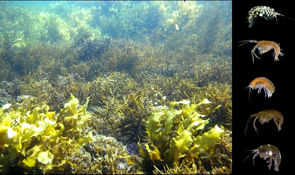

Being able to make new variables from those already in your data set is an essential skill for data manipulation prior to making graphs or doing analyses. These new variables could be a transformed variable that you would like to analyse, a new variable that is a function of existing ones, or a new set of labels for your samples.

To demonstrate a few of the commonly used functions in R for doing this, let's consider a data set on the feeding specificity of marine herbivores on five species of macroalgae. Twenty replicate individuals of each of seven species of macroalgae were collected from Sydney Harbour, and the abundance of seven species of herbivorous crustacean recorded from each replicate sample (data from [Poore *et al*. 2000)](http://www.int-res.com/abstracts/meps/v208/p183-196/).



Download the data set, [Herbivore_specialisation.csv](/datasets/Herbivore_specialisation.csv), and load into R.

```{r}
Herbivores <- read.csv(file = "Herbivore_specialisation.csv", header = TRUE)
```

The first two columns are categorical variables that label the samples as coming from each of the five habitats or as being collected during the day or the night. The third column is the replicate number per combination of habitat and day/night. The fourth column is the biomass of the habitat sampled and the rest of the columns are the counts of each herbivore species in each sample.
  

### Adding a new variable
 


Adding a new variable to an existing data frame can be done by assigning the outcome of a given function to a new variable name in the following fashion.

```{r, eval = FALSE}
Herbivores$log_Mass <- log(Herbivores$Mass)

Herbivores$Ampithoe <- Herbivores$Ampithoe_caddi + Herbivores$Ampithoe_kava + Herbivores$Ampithoe_ngana
```

The first line creates a new variable called log_Mass which is the log of the variable Mass from the Herbivores data frame.

The second line creates a new variable called Ampithoe which is the sum of the abundances for each of the three species of Ampithoe in the data set.

Having to reference both the data frame and the variable name in these expressions can get pretty messy, so we recommend using functions from the package [dplyr](https://cran.r-project.org/web/packages/dplyr/index.html) which allow us to just use variable names. First, load the package:

```{r, warning=F,message=F}
library(dplyr)
```

The function `mutate` is then used to create new variables. To achieve the same result as the above code, we would use:

```{r}
Herbivores <- mutate(Herbivores, log_Mass = log(Mass))

Herbivores <- mutate(Herbivores, Ampithoe = Ampithoe_caddi + Ampithoe_kava + Ampithoe_ngana)
```

Even neater is to run several things at once. We could create both of those new variables and many others with single block of code. For example:

```{r}
Herbivores <- mutate(Herbivores,
  log_Mass = log(Mass), # log of Mass
  Ampithoe = Ampithoe_caddi + Ampithoe_kava + Ampithoe_ngana, # sum of three columns
  Total_abundance = rowSums(Herbivores[, 5:12]), # sum of columns 5-12 with all abundance data
  Total_abundance_perGram = Total_abundance / Mass # abundance as numbers per g of habitat
)
```

The arguments of `mutate` are simply the name of the data frame followed by any number of expressions that create new variables.

In the above examples, note that the new variables have been added to the existing data frame, and all old variables have been kept. You can use `transmute` if you want to drop the original variables.

These functions become especially powerful when combined with some of the others in dplyr. See our pages on [subsetting](/../data-manipulation/subsetting-data/) and [summarising](/../data-manipulation/summarising-data/) data. 
  

### Renaming a variable
 
dplyr offers a straightforward function, `rename`, to change the name of any variable. For example, to change Mass to Biomass, we simply use:

```{r}
Herbivores <- rename(Herbivores, Biomass = Mass)
```
  

### Uniting several columns into one
 


Combining the content of several columns into a single column can be useful to provide a different set of labels for rows in your data set, or new levels of a categorical variable that you may want to use in graphs. The function `unite` in the package [tidyr](https://blog.rstudio.org/2014/07/22/introducing-tidyr/) allows us to do this very easily. First, install and load this package into R.

```{r}
library(tidyr)
```

If we wanted to make a new categorical variable where each level was the unique combination of habitat and day/night, we would use:

```{r,eval=FALSE}
Herbivores <- unite(Herbivores, "Habitat_DayNight", c(Habitat, DayNight), sep = "_")
```

The arguments of `unite' are: 
* the data frame to be used (in this case Herbivores) 
* the name of the new variable (in this case "Habitat_DayNight") 
* the columns to be united, within `c()` 
* the character used to separate the values in each column being united (in this case "_") 

View the data frame again and you will notice the new variable, and the fact that the old ones have been removed. It is a better idea to keep them, by adding `remove=FALSE`

```{r}
Herbivores <- unite(Herbivores, "Habitat_DayNight", c(Habitat, DayNight), sep = "_", remove = FALSE)
```
  

### Separating one column into several
 


Separating content from one column into several separate variables is also very useful if the levels of categorical variables in the original data set are actually combinations of more than one variable. The function `separate` in tidyr does this.

For example, if we wanted to contrast the abundance of herbivores among the genera of algae being used as habitat (rather than individual species), we would need to make a new variable that held only the genus names. We can use `separate` to make two new columns, one for genus and one for species, from the values in the Habitat variable.

```{r}
Herbivores <- separate(Herbivores, Habitat, c("Genus", "species"), sep = "_", remove = FALSE)
```

The arguments of `separate' are: 
* the data frame to be used (in this case Herbivores) 
* the name of the new variable to be separated (in this case "Habitat") 
* the names of the new variables, within `c()` (in this case "Genus" and "species") 
* the character used to separate the values in the column being separated (in this case "_")  
* the `remove=FALSE` means we keep the variable being separated in the new version of the data frame 

Note that this was only possible because there was a character separating the two variables in the text of the one to be separated (e.g., we couldn't do this is if the species names in the Habitat variable were originally GenusSpecies, rather than Genus_species).
  

### Further help
 
Type `?mutate`, `?unite`, and `?separate` for the R help for these functions.

[Data wrangling with dplyr and tidyr cheat sheet](https://www.rstudio.com/wp-content/uploads/2015/02/data-wrangling-cheatsheet.pdf) produced by Rstudio. Some images above were sourced from this document.

[Introducing tidyr](https://blog.rstudio.org/2014/07/22/introducing-tidyr/)
  

**Author:** Alistair Poore
 
**Year:** 2016

**Last updated:** `r format(Sys.time(), "%b %Y")`


