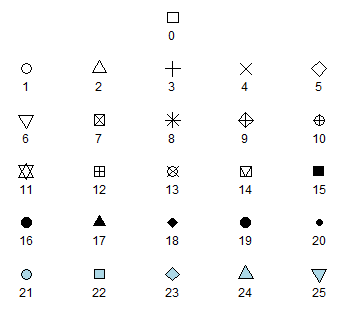

Visualising the relationship between two continuous variables is one of the most commonly used graphical techniques in the sciences. This page details how to produce simple scatterplots to display how one continuous variable is related to another.


  

For this worked example, download a data set on plant heights around the world, [Plant_height.csv](/datasets/Plant_height.csv), and import into R.

```{r}
Plant_height <- read.csv(file = "Plant_height.csv", header = TRUE)
```
  

###Scatterplots###
 
To visualise how plant height varies with temperature, we can use a simple scatterplot, using the `plot` function. Place the Y variable on the left of the tilde (~) and the X variable on the right. The `data=Plant_height` argument tells R to look in the data frame Plant_height for those two variables.

```{r}
plot(height ~ temp, data = Plant_height)
```

If the two variables you would like to plot are in different objects in R, you would simply use:

```{r, eval=F}
plot(y ~ x)
```

where *y* and *X* are two vectors of equal length. 
  

### Formatting plots
 
Scatterplots can be formatted using the basic R formatting in the graphics package. The code below details some of the more commonly used formatting commands for simple scatterplots. These commands can be used for any plotting function in the graphics package.

**Add axis labels or titles**
Axis labels are produced with the `xlab` and `ylab` arguments. Titles are provided with the `main` argument. Note that figures in scientific publications rarely have a title, but include information about the plot in a figure legend presented below the plot.

```{r}
plot(height ~ temp, data = Plant_height, xlab='Temperature (°C)', ylab = 'Plant height (m)',main='Plant height vs temperature')
```

**Edit axis limits**
Axis limits are set by the `xlim` and `ylim` arguments, where a vector of the minimum and maximum limits is required. For example to set the Y axis to have a minimum of zero and a maximum of 80 m, and the x axis to range between -20 and 30, use:

```{r,eval=FALSE}
plot(height ~ temp, data = Plant_height, xlab='Temperature (°C)', ylab = 'Plant height (m)', ylim = c(0,80),xlim = c(-20,30))
```

**Symbol style**
The choice of symbols to use in plotting is extensive and choices are accessed using the `pch` argument in the graphical parameters. Type `?pch` to see all the choices. 



A solid circles `pch=16` or `pch=19` are often the neatest way to display data on a scatterplot.
```{r}
plot(height~temp,data=Plant_height, xlab='Temperature (°C)', ylab = 'Plant height (m)', ylim = c(0,80),pch=16)
```

**Adding colour**
 
Colour can be added to any part of the plots (axis, fonts etc.) using `col` argument. There are over 600 colours that can be plotted, type `colours()` for the whole range.

Here we will simply change the colour of the symbols to blue.
```{r}
plot(height~temp,data=Plant_height, xlab='Temperature (°C)', ylab = 'Plant height (m)', pch=16, col="blue")
```


**Adding a line of best fit**
 
To further explore the relationship between two variables you can add a line of best fit. For example, to add the line of best fit from a simple linear regression, we would use the linear modelling function, `lm`, to obtain the slope and intercept, and add this line to the scatterplot via the graphical parameter `abline`.

See the page on [linear regression](/statistics/linear-model/linear-regression/) for the analysis of tree height versus temperature for this data set. The dependent variable analysed was the log transformed data for tree height (loght). To plot this against temperature with the line of best fit from the linear model, we would use:

```{r}
plot(loght ~ temp, data = Plant_height, xlab='Temperature (°C)', ylab = 'log(Plant height)',pch=16)
abline(lm(loght ~ temp, data = Plant_height))
```
  

### Further help
 
Type `?plot` and `?abline` to get the R help for these functions. 

  

**Authors**: Stephanie Brodie & Alistair Poore
 
Last updated:
```{r,echo=F}
date()
```

