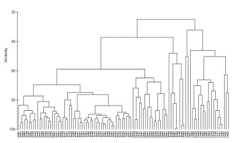

Cluster analysis is a method of classification, aimed at grouping objects based on the similarity of their attributes. It is commonly used to group a series of samples based on multiple variables that have been measured from each sample. The procedure produces a tree-like diagram (a dendrogram) that illustrates the relationships between all the samples based on a defined measure of similarity.



There are many methods available for clustering (agglomerative, divisive, non hierarchical etc.). Here are some instructions for one of the more commonly used methods, agglomerative hierarchical clustering. This procedure involves a series of steps: 

* calculate a matrix that holds all pair-wise similarities among all objects  
* join together the pair of objects that are most similar  
* recalculate the similarity matrix for that cluster vs all remaining objects  
* repeat last two steps until all objects are joined  
<br><br>

### Running the analysis
<br>


In this example, we will use cluster analysis to visualise differences in the composition of metal contaminants in the seaweeds of Sydney Harbour (data from [(Roberts *et al.* 2008)](http://www.sciencedirect.com/science/article/pii/S026974910800033X).). Download the data set, [Harbour_metals.csv](http://environmentalcomputing.net/wp-content/uploads/2016/05/Harbour_metals.csv), and load into R.

```{r}
Harbour_metals <- read.csv(file="Harbour_metals.csv", header=TRUE)
```

These data have the concentrations of seven metals measured from 60 samples, half from the seaweed *Padina crassa* and half from the *Sargassum linearifolium*

The first two columns are categorical variables that group samples by site and seaweed species. The third column has unique labels for each replicate sample and the remaining columns are the metal concentrations.

The cluster analysis runs on the response variables only so we need to make a data frame with just the metal concentrations (columns 4-8).

```{r}
Harbour_metals2 <- Harbour_metals[,4:8]
```

To help interpret the graph, we can add the sample labels as row names in this data frame

```{r}
rownames(Harbour_metals2) <- Harbour_metals$Rep
```

To perform the cluster analysis, we need to make a matrix that quantifies the similarity between each pair of samples. Here we will use the Euclidean distance as our similarity coefficient, but there are others to choose from (see below).

```{r}
H_metals.sim <- dist(Harbour_metals2, method = "euclidean")
```

We then use `hclust` function with an argument that specifies the linkage method (here we will use the single linkage method).

```{r}
H_metals.cluster <- hclust(H_metals.sim, method = "single")
```

Finally, plot the object that was created by the <font face="monospace">hclust</font> function.

```{r}
plot(H_metals.cluster)
```

We can make this a bit neater with all the samples lined up along the bottom by converting it to a dendrogram object (the `as.dendrogram` function) and plotting that (although this default plot is still a bit ugly and would need work with labels and axes before being ready for publication).

```{r}
plot(as.dendrogram(H_metals.cluster),ylab = "Euclidean distance")
```
<br><br>


### Interpreting the results
<br>
A dendrogram has a branch for each sample joined at nodes that relate to the value of the similarity coefficient that joined the two objects. Interpretation of all the relationships comes from examination of the branching structure (which objects join most closely with each other) and from the similarities at which they join. Objects that join together close the tips of the branches are more similar to each other than those that join further toward the base of the tree (note that the default dendogram in R is like an upside down tree with the branches at the bottom and trunk at the top).

Strong evidence for distinct groups would be evident if there were clusters where the samples within a cluster are much more similar to each other than samples in other clusters.
<br><br>

### Assumptions to check
<br>
Before running a cluster analysis to create a dendrogram, you need to consider:

**What measure of similarity to use.** Dendograms can be created from any similarity matrix. There are many distance measures that can be used to describe the similarity between samples. The `dist` fuction in R has `"euclidean"`, `"maximum"`, `"manhattan"`, `"canberra"`, `"binary"` or `"minkowski"` (specified in the method argument of `dist`). Other measures are available in other packages (e.g., the Bray-Curtis measure which is recommended for analyses of species composition data is available in the package vegan).

**Whether the data need transforming or standardising.** If the variables are measured on very different scales, or if there are outliers, then the structure of the dendrogram will be strongly influenced by the values of the largest values in the data set. Variables can be transformed or standardised to lessen the influence of large values (i.e., treat all variables on a more equal footing).

**What method will be used to create the dendrogram.** The structure of dendrograms can also be sensitive to algorithm used to construct the tree (the linkage method). In the previous example, you used the single linkage method. The `hclust` function in R has several available: `"ward"`, `"single"`, `"complete"`, `"average"`, `"mcquitty"`, `"median"` and `"centroid"`.
<br><br>

### Communicating the results
<br>
**Written.**  The interpretation of the dendrogram would be described in the text of a Results section (i.e, were there any obvious clusters of samples? were there any samples that were very different from the rest?). There are no numerical results to report.

**Visual.**  Results from cluster analyses are communicated visually with the dendrogram. It is important to label the axis to show what measure of similarity was used in the analysis.

If there are pre-determined groups of samples (e.g., samples grouped by species in the example above) samples are usually labelled or provided with colour-coded symbols to allow patterns in the dendrogram to be more easily seen. With large data sets individual labels for each sample (as we did here) make for very plots.

With many samples in your dendrogram it is often necessary to label them in some way (e.g., by colour) to help see patterns. The package [dendextend](https://cran.r-project.org/web/packages/dendextend/vignettes/FAQ.html) allows you to do this. Here is some code to produce the same dendrogram with the samples colour coded by location.

```{r, fig.width=6,warning=F, message=F}
library(dendextend)
dend <- as.dendrogram(H_metals.cluster)
sample_colours <- as.numeric(Harbour_metals$Location)
sample_colours <- sample_colours[order.dendrogram(dend)]
labels_colors(dend) <- sample_colours
plot(dend,ylab = "Euclidean distance")
```
<br><br>

### Further help
<br>
You can access R help for the main functions used here by typing `?hclust`, `?dist` or `?as.dendrogram`. There are many R packages associated with the many different types of cluster analysis. See a long list of possibly useful packages [here](http://cran.cnr.berkeley.edu/web/views/Cluster.html).

<p style="margin-left: .5in; text-indent: -.5in;">Quinn, GP and MJ Keough (2002) *Experimental design and data analysis for biologists*. Cambridge University Press. Ch. 18. Multidimensional scaling and cluster analysis.</p>

<p style="margin-left: .5in; text-indent: -.5in;">McKillup, S (2012) *Statistics explained. An introductory guide for life scientists.* Cambridge University Press. Ch. 22. Introductory concepts of multivariate analysis.</p>

[Visualizing dendrograms in R](http://rpubs.com/gaston/dendrograms)
<br><br>

**Author**: Alistair Poore
<br>
Last updated:
```{r,echo=F}
date()
```
