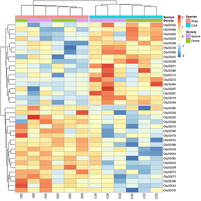

```{r setup, include=FALSE}
knitr::opts_chunk$set(
  echo = TRUE,
  fig.height = 10,
  fig.width = 10,
  fig.align = "center", comment = NA
)
```

Heatmaps are a useful method to explore large multivariate data sets. Response variables (e.g., abundances) are visualised using colour gradients or colour schemes. With the right transformation, and row and column clustering, interesting patterns within the data can be seen. They can also be used to show the results after statistical analysis, for example, to show those variables that differ between treatment groups.



In this tutorial, we will use heatmaps to visualise patterns in the bacterial communities found within marine habitats in the presence of two macrophytes (seagrass and *Caulerpa*) at two densities (sparse and dense). There are also samples from unvegetated sediment (Other). There are three replicate samples in each group.

We will use the package [pheatmap](https://cran.r-project.org/web/packages/pheatmap/index.html) (pretty heatmaps) to draw our heatmaps. The base package of R can draw heatmaps as well, but is somewhat limited. First, install the package and load into R. We will also need the package dplyr for selecting rows and columns.

```{r,message=F}
library(pheatmap)
library(dplyr)
```
  

### Reading in the data
 
With multivariate data, we often have two data frames with 1) the counts per sample and 2) the factors that group samples. Download these two data files, [Bac.counts.csv](/datasets/Bac.counts.csv) and [Bac.factors.csv](/datasets/Bac.factors.csv), and import into R.

```{r}
Bac.counts <- read.csv(file = "Bac.counts.csv", header = TRUE, row.names = 1)
Bac.factors <- read.csv(file = "Bac.factors.csv", header = TRUE, row.names = 1)
```

The `row.names=1` argument assigns the first column of the spreadsheet as row names in the data frame. We should check the data structure of the counts using the `head` command. Given there are many columns, we'll only check the first 10 using indexing (use of `[,]` after the object, with row numbers before the comma and column numbers after).

```{r}
head(Bac.counts[, 1:10])
```

We can see that the row names of the data have the code numbers for each operational taxonomic unit (OTU) of bacteria and there are integer counts of these in each sample. Now, we will check the dimensions of the data (number of rows and columns).   

```{r}
dim(Bac.counts)
```

There 4299 bacterial operational taxonomic units (OTUs) as rows among 15 samples as columns.  

Next we can check the structure of the factor information using `str`. In this experiment, samples are categorised by a treatment ID (each combination of density and species), density levels and species levels. The other columns are for plotting purposes elsewhere.

```{r}
str(Bac.factors)
```
  

### Drawing a heatmap
 
The basic function is `pheatmap`. Let's try it without special arguments, except that we will only look at the first 500 OTUs (they are arranged from highest to lowest total abundance already). The function `slice` in dplyr can take any subset of numbered rows (see [Subsetting data](/data-manipulation/subsetting-data/)). 

```{r}
Bac.counts500 <- slice(Bac.counts, 1:500)

pheatmap(Bac.counts500)
```

In the figure, samples are columns and bacterial OTUs are rows, with the colour representing the range of counts of each OTU in each sample. Red means most abundant (~3500 counts), blue the least abundant (0 counts) and light yellow somewhere in the middle. Note that both the rows and columns have been rearranged based on measures of similarity among rows and columns (see [Cluster analysis](/graphics/cluster-analysis/)).

**Data transformation**. Now you might notice that we have a scale issue. The data are full of rare-ish bacteria (blue) and that is all we can see on the heatmap. To visualise this more effectively, we can try a log10 transformation with + 1 constant to deal with zeros.

```{r}
Bac.Log10.counts500 <- log10(Bac.counts500 + 1)
pheatmap(Bac.Log10.counts500)
```

The view of the data has really changed with transformation, so has the row and column clustering. There appears to be some very abundant OTUs (red/yellow), some mid abundant (white/low) and low in low abundance (blue).

This would not have been seen so clearly if we did not cluster the rows and columns, and if we had just plotted them "as is" from the data table (although some row ordering had already been done here). You can see this if we draw the heatmap again without clustering the rows and columns.

```{r}
pheatmap(Bac.Log10.counts500, cluster_rows = FALSE, cluster_cols = FALSE)
```
  

### Colouring sample groups
 
Before looking further at how clustering effects the patterns observed, we should add some colours associated with the treatment groups next. The simplest method is to use the Bac.factors dataframe as input, taking care that you 1) specify categorical covariates (factor groups) and numerical covariates (e.g. concentration) properly, 2) that row names in Bac.factors match those in Bac.counts, and 3) then remove the factors you do not want to show.

To extract just the density and species columns from our factors data frame, we can use `select` from the package dplyr and then use these to colour code our samples.

```{r}
Bac.factorsDS <- select(Bac.factors, Density, Species)

pheatmap(Bac.Log10.counts500, annotation_col = Bac.factorsDS)
```

The colours are pretty ugly. To make your own is tricky, but involves making named colour vectors and then adding them to a list. This represents the "colour annotation" information. We have to define colours for categorical covariate (factor groups) and colour ranges for numerical covariates (e.g. concentration).

```{r}
# Reorder Density levels to Sparse, Dense, Other
Bac.factorsDS$Density <- factor(Bac.factorsDS$Density, levels = c("Sparse", "Dense", "Other"))
DensityCol <- c("darkorchid", "darkorange", "grey80")
names(DensityCol) <- levels(Bac.factorsDS$Density)

# Reorder Species to Seagrass, Caulerpa, Other
Bac.factorsDS$Species <- factor(Bac.factorsDS$Species, levels = c("Seagrass", "Caulerpa", "Other"))
SpeciesCol <- c("forestgreen", "blue3", "grey80")
names(SpeciesCol) <- levels(Bac.factorsDS$Species)

# Add to a list, where names match those in factors dataframe
AnnColour <- list(
  Density = DensityCol,
  Species = SpeciesCol
)

# Check the output
AnnColour
```

We can now redraw the heatmap with our chosen colours.

```{r}
pheatmap(Bac.Log10.counts500, annotation_col = Bac.factorsDS, annotation_colors = AnnColour)
```

In this case, letting the data speak for itself (with default row and column clustering) shows that the unvegetated samples (Other) are dissimilar to the macrophyte samples (regardless of density) and that the seagrass samples generally cluster together. Note that other methods (e.g., ordination) can show sample to sample comparisons much better than heatmaps, but heatmaps reveal the patterns of the variables unlike those methods. Understanding what the data is doing is often overlooked in multivariate analysis.
  

### Row and column clustering methods
 
By default, `pheatmap` is using Euclidean distance as the similarity measure and clustering samples based on the 'complete' method. There are various other distance and clustering methods available by using additional arguments: `clustering_distance_rows`, `clustering_distance_cols` and `clustering_method`.

Some are better than others, but you'll have to consult the literature further on this. For clustering, however, 'average' clustering seems superior in many computer science applications. Again, the benefit of heatmaps is that you see what the data are doing relative to the options you have chosen.

Let's see what is produced by using the Manhattan distance as the measure of similarity between rows and columns, and the average clustering method.

```{r}
pheatmap(Bac.Log10.counts500,
  clustering_distance_rows = "manhattan",
  clustering_distance_cols = "manhattan", clustering_method = "average",
  annotation_colors = AnnColour, annotation_col = Bac.factorsDS
)
```

You can see that changing the clustering has significantly changed the heatmap produced.
  

### Scaling variables
 
We may want to compare the abundance of each bacterial OTU only among samples rather than contrasting their abundance with other OTUs of varying abundance. To do this, we can scale the abundances within each OTU such that the colour scale shows only the relative range of abundance for each individual OTU. In this example, that involves scaling abundance for each row with `scale="row"`.

```{r}
pheatmap(Bac.Log10.counts500,
  scale = "row", clustering_distance_rows = "manhattan",
  clustering_method = "average",
  annotation_colors = AnnColour, annotation_col = Bac.factorsDS
)
```

We can now see how many standard deviations the Log10 abundance of a single OTU is away from the mean for that OTU in a sample compared only with other samples for that OTU. The legend shows that the number of standard deviations ranges from +3 to -3. We can see how a number of the bacterial OTUs are under-represented in the in the unvegetated sediment (blue abundances in the bottom left) compared with the sediment with macrophytes (yellow/red abundances).
  

### Sorting by group
 
We can also sort the samples by their groups or treatments rather than sorting by similarity among rows or columns. This is done by ordering the input data and turning off the clustering of the columns with `cluster_cols=FALSE`.

```{r}
SampleOrder <- order(Bac.factorsDS$Species, Bac.factorsDS$Density)

pheatmap(Bac.Log10.counts500[, SampleOrder],
  cluster_cols = FALSE,
  clustering_method = "average", annotation_colors = AnnColour, annotation_col = Bac.factorsDS
)
```
  

### Using heatmaps after statistical analyses
 
If we have analysed our multivariate data and identified those variables that differed between treatments, we can choose to plot only them in the heatmap. In this example, we will only look at those bacterial OTUs that differed between the two levels of the Species factor after removal of the unvegetated samples.

We will analyse the abundances of all OTUs with multivariate generalised linear models using the function `manyglm` in the package mvabund. The specifics of that analysis are not described further here (see the [Introduction to mvabund](/statistics/mvabund/) for help with that package). Note that running `anova.manyglm` is quite slow.

```{r,eval=F}
# Create factor and data file without the U1, U2 and U3 samples
Bac.factorsDS_noU <- filter(Bac.factors, Treatment_ID != "U")
Bac.counts500DS_noU <- select(Bac.counts500, -contains("U"))

# Mvabund
library(mvabund)
dat.mva <- mvabund(t(Bac.counts500DS_noU))
plot(dat.mva)
dat.nb <- manyglm(dat.mva ~ Species * Density, data = Bac.factorsDS_noU)
dat.aov <- anova.manyglm(dat.nb, p.uni = "unadjusted", nBoot = 500)
dat.aov$uni.p[, 1:5]
SpeciesDiffs <- which(dat.aov$uni.p["Species", ] < 0.05 & dat.aov$uni.p["Species:Density", ] > 0.05)
```

We can include the argument `cutree` for the rows and columns, to split data into the two expected groups. Fingers crossed it shows that we expect.

```{r,echo=F}
load("SpeciesDiffs.Rdata")
```

```{r}
# Create a vector that will be used to select samples that are not from the sediment
DS <- Bac.factors$Treatment_ID != "U"

pheatmap(Bac.Log10.counts500[SpeciesDiffs, DS],
  scale = "row",
  clustering_method = "average", annotation_col = Bac.factorsDS,
  cutree_rows = 2, cutree_cols = 2
)
```

And the results are as expected. The top half of the heatmap shows those variables over-represented in the Species level Caulerpa. The bottom half are those over-represented in seagrass.  

Happy heatmapping!  
  

### Further help
 
Type `?pheatmap` for the R help on this function.
  

**Author:** Shaun Nielsen
 
**Year:** 2016

**Last updated:** `r format(Sys.time(), "%b %Y")`

