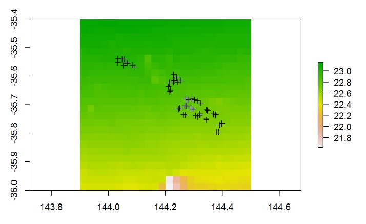

R has a very wide range of functions and packages for visualising spatial data. This page will link to a series of tutorials for handling spatial data and making maps.  

* [Making simple maps with ggmap](/../spatial-vis/simple-maps/)  
* [Making maps from shapefiles]
* More soon...

