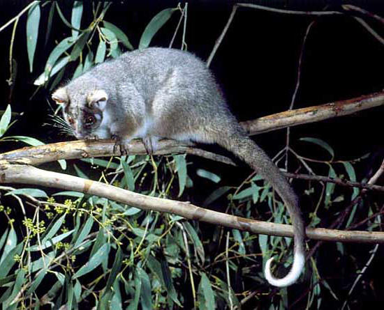

Some people notice a distinctive smell from their urine after eating asparagus, while others never notice the smell. These differences could arise from variation among people in the chemical profile of the urine (i.e., how compounds from asparagus are metabolised), or from variation in the ability of different people to detect the smell.

A paper (Pelchat *et al.* 2010 *Chemical Senses*) reviewed these studies and presented the following data that described variation among four study populations:

Israel (Lison et al. 1980), 328, 0
China (Hoffenberg 1983), 96, 2
USA (Sugarman and Neelon 1985), 10, 5
USA (Lison et al. 1980), 11, 10

```{r}
asparagus <- matrix(c(328, 96, 10, 11, 0, 2, 5, 10), nrow = 4, dimnames = list(c("Israel", "China", "USA.1", "USA.2"), c("Can detect odour", "Cannot detect odour")))
asparagus
```

**Q1**  What numbers of people would be expected to smell the odour in each population if all study populations had the same proportion of people able to detect the odour?

```{r}
chisq.test(asparagus, correct = F)$expected
```

**Q2**  What statistical test could you use to detect differences among populations in the perception of the odour? Ensure you check that the assumptions of the test are met.

**Q3** Run your chosen test. What is your P value?

```{r}
fisher.test(asparagus)
```


```{r, echo=FALSE}
# If instructor copy, use INST = TRUE to see inline code output.
library(knitr)
INST <- FALSE

if (INST == TRUE) opts_chunk$set(fig.keep = "all", results = "markup", echo = TRUE)
if (INST == FALSE) opts_chunk$set(fig.keep = "none", results = "hide", echo = FALSE)
```



You are a behavioural ecologist studying the diet of common ringtail possums (*Pseudocheirus peregrinus*) at two sites (sites A and B) dominated by two species of Eucalyptus, (*E. ovata* and *E. sideroxylon*).

You notice that possums at site A tend to eat  *E. ovata* and that at location B they mostly eat  *E. sideroxylon*. To test whether the populations at each site differ in the feeding preferences, you attach radio collars to seven possums at location A and eight possums at location B. You track each possum and note the species of the first tree that you observe it eating leaves from.

At location A you see six possums eat *E. ovata* and one (1) eat *E. sideroxylon*. At location B, none eat *E. ovata* and you see all eight eat *E. sideroxylon*. 


**Q1** What is the exact probability of observing this or a more extreme pattern by chance alone?

```{r}
possum <- matrix(c(6, 0, 1, 8), nrow = 2, dimnames = list(c("Site A", "Site B"), c("E. ovata", "E. sideroxylon")))
possum
fisher.test(possum)
```

**Q2** Is there evidence to suggest that the possums at site A and B differ in their use of food trees?


**Author**: Alistair Poore
 
Last updated:
```{r,echo=F}
date()
```
