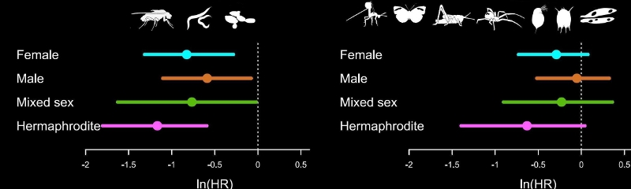

### Background

What is a meta-analysis?

> A meta-analysis is a quantitative summary of studies on the same topic. 

Why do we want to perform a meta-analysis?

a. Finding generalities
b. Increasing power and precision
c. Exploring differences between studies
d. Settling controversies from conflicting studies (testing hypotheses)
e. Generating new hypotheses



**The process of meta-analysis**

How many steps involved in meta-analysis?

One answer is 5 steps

i. Formulating questions & hypothesis or finding a topic
ii. Literature search & paper collection
iii. Data extraction & coding
iv. Meta-analysis & publication bias tests
v. Reporting & publication

We only consider the step iv in this tutorial. You will need to learn the other steps elsewhere. To get you started, we recently wrote an overview paper which divides the process of meta-analysis into 10 questions [(Nakagawa *et al.* 2017)](https://bmcbiol.biomedcentral.com/articles/10.1186/s12915-017-0357-7). The 10 questions will guide you through judging the quality of a meta-analysis. 

1. Is the search systematic and transparently documented?
2. What question and what effect size?
3. Is non-independence taken into account?
4. Which meta-analytic model?
5. Is the level of consistency among studies reported?
6. Are the causes of variation among studies investigated?
7. Are effects interpreted in terms of biological importance?
8. Has publication bias been considered?
9. Are results really robust and unbiased?
10. Is the current state (and lack) of knowledge summarized?


### Metafor for meta-analysis

I think the R package [metafor](http://www.metafor-project.org/doku.php) (Viechtbauer 2010) is the most comprehensive meta-analytic software and the author [Wolfgang Viechtbauer](http://www.wvbauer.com/doku.php), who, I have to say, has the coolest name among my friends, is still actively developing it.

First, install and load the `metafor` package.

```{r setup, tidy=TRUE, message=FALSE, warning=FALSE}
library(metafor)
```

Have a look at the data set named `dat.curtis1998` included in the package. If you have to see the other data sets included in this package, try `help(package="metafor")`.

```{r}
dat <- metafor::dat.curtis1998
str(dat)
```

This data set is from the paper by Curtis and Wang (1998). They looked at the effect of increased CO$_2$ on plant traits (mainly changes in biomass). So we have information on control group (1) and experimental group (2) (m = mean, sd = standard deviation) along with species information and experimental details. In meta-analysis, these variables are often referred to as 'moderators' (we will get to this a bit later). 


### Calculating 'standardized' effect sizes

To compare the effect of increased CO$_2$ across multiple studies, we first need to calculate an effect size for each study - a metric that quantifies the difference between our control and experimental groups.

There are several 'standardized' effect sizes, which are unit-less. When we have two groups to compare, we use two types of effect size statistics. The first one is standardized mean difference (SMD or also known as Cohen's $d$ or Hedge's $d$ or $g$; some subtle differences between them, but we do not worry about them for now):

\begin{equation}
\mathrm{SMD}=\frac{\bar{x}_{E}-\bar{x}_{C}}{\sqrt{\frac{(n_{C}-1)sd^2_{C}+(n_{E}-1)sd^2_{E}}{n_{C}+n_{E}-2}}}
\end{equation}
where $\bar{x}_{C}$ and $\bar{x}_{E}$ are the means of the control and experimental group, respectively, $sd$ is sample standard deviation ($sd^2$ is sample variance) and $n$ is sample size. 

And its sample error variance is:

\begin{equation}
se^2_{\mathrm{SMD}}= \frac{n_{C}+n_{E}}{n_{C}n_{E}}+\frac{\mathrm{SMD}^2}{2(n_{C}+n_{E})}
\end{equation}

The square root of this is referred to as 'standard error' (or the standard deviation of the estimate -- confused?). The inverse of this ($1/se^2$) is used as 'weight', but things are bit more complicated than this as we will find out below. 

Another common index is called 'response ratio', which is usually presented in its natural logarithm form (lnRR):

\begin{equation}
\mathrm{lnRR}=\ln\left({\frac{\bar{x}_{E}}{\bar{x}_{C}}}\right)
\end{equation}

And its sampling error variance is:

\begin{equation}
se^2_\mathrm{lnRR}=\frac{sd^2_{C}}{n_{C}\bar{x}^2_{C}}+\frac{sd^2_{E}}{n_{E}\bar{x}^2_{E}}
\end{equation}

Let's get these using the function `escalc` in `metafor`. To obtain the standardised mean difference, we use:

```{r effect-size, tidy=TRUE}
# SMD
SMD <- escalc(
  measure = "SMD", n1i = dat$n1i, n2i = dat$n2i,
  m1i = dat$m1i, m2i = dat$m2i,
  sd1i = dat$sd1i, sd2i = dat$sd2i
)
```

where `n1i` and `n2i` are the sample sizes, `m1i` and `m2i` are the means, and `sd1i` and `sd2i` the standard deviations from each study.

The oject created now has an effect size (yi) and its variance (vi) for each study

```{r,echo=F}
head(SMD)
```

To obtain the response ratio (log transformed ratio of menas), we would use:
```{r effect-size-2, tidy=TRUE}
lnRR <- escalc(
  measure = "ROM", n1i = dat$n1i, n2i = dat$n2i,
  m1i = dat$m1i, m2 = dat$m2i,
  sd1i = dat$sd1i, sd2i = dat$sd2i
)
```

The original paper used lnRR so we will use it, but you may want to repeat analysis below using SMD to see whether results are consistent.

Add the effect sizes to the original data set with `cbind` or `bind_cols` from the package `dplyr`

```{r, tidy=TRUE, message=FALSE, warning=FALSE}
library(dplyr)
dat <- bind_cols(dat, lnRR)
```

You should see yi (effec size) and vi (sampling variance) are added.

```{r,echo=F}
str(dat)
```

**Visualising effect size.** We can visualize point estimates (effect size) and their 95% confidence intervals, CIs (based on sampling error variance) by using the `forest` function, which draws a forest plot for us.  

```{r forest, tidy=TRUE}
forest(dat$yi, dat$vi)
```

The problem you see is that when there are many studies, a forest plot does not really work (unless you have very large screen!). Let's look at just the first 12 studies. 

```{r forest2, tidy=TRUE}
forest(dat$yi[1:12], dat$vi[1:12])
```

We can calculate many different kinds of effect sizes with `escalc`; other common effect size statistics include $Zr$ (Fisher's z-transformed correlation). By the way, along with my colleagues, I have proposed a new standardized effect size called lnCVR (the log of coefficient of variation ratio -- mouthful!), which compares the variability of two groups rather than means. See whether you can calculate it with these data. Actually, the development version of `metafor`, let you do this with `escalc`-- [github page](https://github.com/cran/metafor). lnCVR is called "CVR" in `escalc`. Actually, if you re-analysis this data with lnCVR, you may be able to publish a paper! Nobody has done it yet. Do it tonight! 


Once you have calculated effect sizes, move on to the next page: [Meta-analysis 2: fixed-effect and random-effect models](/statistics/meta-analysis/meta-analysis-2meta-analysis-2)

### Further help (references)

Go to the metafor package's [website](http://www.metafor-project.org/doku.php). There you find many worked examples.

<p style="margin-left:.5in;text-indent:-.5in">Curtis, P. S., and X. Z. Wang. 1998. A meta-analysis of elevated CO2 effects on woody plant mass, form, and physiology. *Oecologia* 113:299-313.</p>

<p style="margin-left:.5in;text-indent:-.5in">Nakagawa, S., R. Poulin, K. Mengersen, K. Reinhold, L. Engqvist, M. Lagisz, and A. M. Senior. 2015. Meta-analysis of variation: ecological and evolutionary applications and beyond. *Methods in Ecology and Evolution* 6:143-152.</p>

<p style="margin-left:.5in;text-indent:-.5in">Viechtbauer, W. 2010. Conducting meta-analyses in R with the metafor package. *Journal of Statistical Software* 36:1-48.</p>

**Authors**: Shinichi Nakagawa and Malgorzata (Losia) Lagisz
 
**Year:** 2016

**Last updated:** `r date()`

