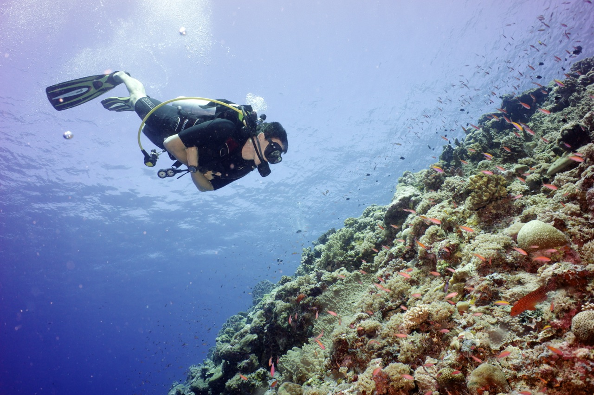

# Welcome to Environmental Computing

## Quantitative tutorials for the environmental sciences

## Getting started with R, data manipulation, graphics and statistics

Students and researchers in the environmental sciences require a wide range of quantitative skills in analytical and data processing software, including R, geographic information systems (GIS) and the processing of remotely sensed data. There is increasingly a need to ensure transparency of data processing supported by statistical analyses to justify conclusions of scientific research and monitoring for management and policy. This site is a brief introduction to techniques for data organisation, graphics and statistical analyses.

