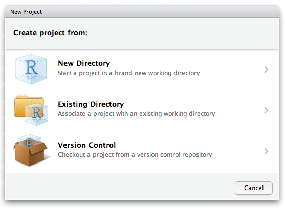

Having your data files, R scripts and outputs organised is very helpful for keeping track of what you are working on and for sharing data or scripts with colleagues or supervisors. Try and avoid a folder on your computer that is a big mix of spreadsheets, images, word processing documents etc. How you organise your files is your choice, but a little bit of planning and project organization at the beginning will pay lots of dividends down the road.  Here are our suggestions for keeping your projects neatly organised.

### Setting up an organised project folder
 
Create a folder on your computer for each project. This could be a course you are currently doing, a chapter of your thesis or a research project of any kind. Within that folder, include the following things:

* A data folder (including meta-data)
* An outputs folder (with subfolders "Figures" and "Tables" and possibly "Supplementary Material")
* An R script that will run the data manipulation, analyses and create figures required for the project (try to keep this R script short and readable)
* A folder for R functions (if used) usually called "R"
* A folder for writing and references called "Manuscripts"

The data folder should hold the raw data (usually entered in a spreadsheet program).   After you finish entering your data, you should aim to keep these data untouched; all the things you want to do with the data, such as data cleaning and [subsetting](/data-manipulation/subsetting-data), [summarising](/data-manipulation/summarising-data) data into table, running statistical [analyses](/statistics) or creating [figures](/graphics), can be done via R scripts.  This keeps a record of everything you do.  Think of this script(s) as the lab notebook for a data scientist. Intermediate outputs are good--separate these from the raw data and save them in the outputs folder.

One goal of this project organization is that your data processing and analysis is entirely reproducible, and as such both the data and exact methods can be shared with colleagues and supervisors, who can then repeat and hopefully build on your analyses. Also, although you might know all the files and steps at the moment, think of yourself in a year once you've moved on to other jobs or projects; try to be nice to your future self and keep good notes. In contrast, if you used a point--and--click or spreadsheet program to do important steps in your analysis, you'll need to remember all the steps taken to recreate the analyses or figures.  Most analyses at some point get too complicated for this to be tractable.  
  

### Using R Studio's project files
 
An easy way to access all these files is to use a project file. In R Studio, you can create a new project file with **File, New Project**. You will then be asked if you want a new directory or to associate it with an existing directory. 



Choose this second option to have a project file associated with the folder that you created above.

Once created, you can open your project by directly clicking on that file or from **File, Open** if you have R Studio open already. Once open, you will see your directory structure in the files panel on the bottom right of R Studio and all your scripts and data are easily accessible.


A big benefit of using a project file is that when you import data, you do not need to specify the working directory with `setwd`. R Studio will look within the folder that contains the project file. When using `read.csv("")`, press tab repeatedly when you are within the `""` to choose the local folders and files:

```{r, eval=F}
read.csv("/Data/Survey_data.csv")
```

The data file is found with a relative file path, rather than the alternatives of a full path in the `read.csv` function or setting the working directory then using `read.csv`

```{r,eval=F}
read.csv("C:/Work/Data/Survey_data.csv")

setwd("C:/Work/Data")
read.csv(file = "Survey_data.csv")
```

Similarly, when you output a file (e.g., figures or tables), you can store than in your outputs folder (away from the raw data)

```{r,eval=F}
write.csv("/Outputs/Survey_summary_table.csv")
```

You can now simply copy your whole project folder to any other computer (desktop to laptop, student to supervisor etc.) and your code will always work without having to change the working directory for every machine.

If you have mutiple R project files, you can easily swap between them by clicking on the project name on the top right of R Studio.
  

### Further help
 
R Studio's help with [using projects](https://support.rstudio.com/hc/en-us/articles/200526207-Using-Projects)
Our introduction to [version control](/coding-skills/version-control/) for keeping track of revisions to project files.
  

**Author**: Alistair Poore & Will Cornwell
 
**Year:** 2016

**Last updated:** `r date()`
