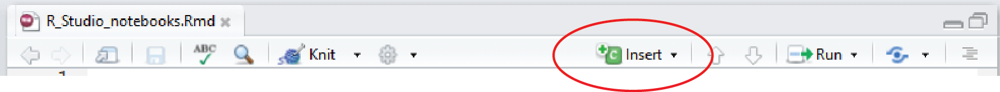
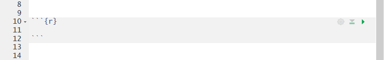
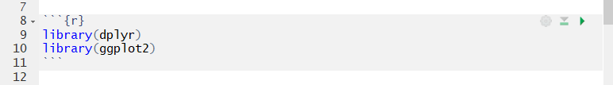
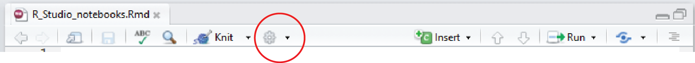
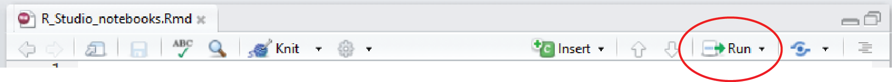
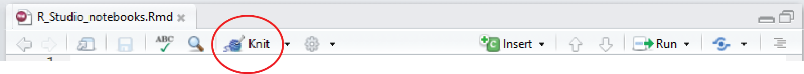

```{r,echo=F,message=F}
library(dplyr)
library(ggplot2)
```

If you are working in the laboratory or in the field, it is essential to keep good notes on what you are doing so that you can remember your methods and ensure that your work is reproducible.


Similarly, once you are dealing with the data you have collected, good notes on how you have processed that data are essential. They help you in understanding exactly what you are doing and are needed to write methods sections, and to communicate both methods and results to collaborators or supervisors.

In a traditional R script, all the text is code and comments are separated from executable code by starting a line with #. For example,

```{r, eval =F}
plot(y ~ x)
# code to make a plot of y vs x
```

This can get messy if you have lots of comments, so we recommend looking at [RStudio notebooks](http://rmarkdown.rstudio.com/r_notebooks.html) as a very clean way of writing your code with associated comments.

RStudio notebooks are a form of markdown document, a widely used format for exporting text and code to various report formats. All web pages on this site start their life as markdown files with all the text, code needed to make the html file. Rstudio notebooks have the added benefits of displaying the output from your code directly in the document.
  

### Creating a new notebook
 
Creating a new notebook is as simple as clicking **File, New File, R Notebook** from the RStudio menu. You will need a recent version of RStudio (1.0 or higher), so update that if necessary.

Save the file in a folder on your computer. This folder will become the working directory for any code in your notebook and there is no need to set the working directory.

Edit the title at the top, have a quick read of the notes then delete the template provided (from "This is an [R Markdown]..."" onwards). Make sure you leave the first few lines in between the --- marks.

Your notebook is now just a big blank page for you to start writing down all the steps involved in your work. For example, you might want to start with a brief description of the project.
  

### Adding code to your notebook



Executable code is added to your notebook in what are called chunks. To do this, click on **Insert, R** from the top right of your notebook (or use **Ctrl + Alt + I** on the keyboard). This will add an empty chunk that looks like this:



Any code that you want to run then be added inside the chunk. I like to use the first chunk in the notebook to load any R packages that might be required for the upcoming work. E.g.,



Be careful not to delete the ``` marks as the text will no longer be recognised as code.
  

### Running the code
 
Running all the code in your chunk is done by clicking the little green arrow at the top right of your chunk. Just like in a script you can still run individual lines of code by entering *Ctrl+Enter* with your cursor on that line.

Use the chunks to organise your workflow, grouping code that does a particular task within a chunk and preceding these by plain text comments that explain what each chunk will do. Avoid putting every single line of code in a separate chunk and avoid having very many lines of code that do different things within the same chunk.

Output from your code will appear directly below the code chunk rather than in the console below or the plots pane to the right. For example, a plot of plant height vs temperature from the data set used in our [linear regression tutorial](/statistics/linear-models/linear-regression).


```{r, eval=F,echo=F}
Plant_height <- read.csv(file = "Plant_height.csv")
ggplot(Plant_height, aes(temp, loght, color = growthform)) +
  geom_point()
```


You can hide or show any output within your notebook by clicking on the little upward arrows (top right of output).




To expand or collapse all output click on the cog symbol next to Preview at the top of the notebook. The settings in there can also be used to send all output to the console (**Chunk output in Console**) or keep in the notebook (**Chunk Output Inline**).

If you save the notebook and leave RStudio, the output is saved and you will see plots etc when you reopen the file. If you have made any changes to code or data files, however, you will need to run the code again. 



This is easily done by clicking **Run, Run all**. Also very useful when you are part way through a document is **Run All Chunks Above** to ensure everything is refreshed and running correctly.
  

### Exporting your notebook to other formats
 
In addition to being a visually appealing way to combine code and comments, notebooks can also be used to create reports in various formats (html, pdf and word).



Clicking on **Preview** will give you a sneak preview of what this might look like. To make the documents, you would then choose **Knit to HTML** for example to make an html file.

The html files created are an excellent way to share your work with collaborators and supervisors. The single document can be opened in any browser on any device and has all comments, code, statistical output and figures. Your reader doesn't need to run any code (or even be an R user) to see what you have done. The html files even have neat little buttons where you can hide and show the code, and the ability to reverse the whole process and download a markdown file from the html.

When you knit to HTML for the first time, you may be prompted for some packages that are not on your machine (e.g., knitr, rmarkdown). If this happens, install those and do it again.

When you first look at your html file, you may also realise that there are some unwanted parts (e.g., warning messages) and that the formatting could improved. To fix these, you need to learn a bit more about controlling the behaviour of code chunks, and some basic formatting.

These are nicely detailed on RStudio's [R Markdown cheatsheet](https://www.rstudio.com/wp-content/uploads/2015/02/rmarkdown-cheatsheet.pdf). Here are a just few of the more useful options:
  . 

### Some basic markdown formatting
 

| Markdown  | Output  |
|-----|----|
| Header 1 |  # Header 1 |
| Header 2 |  ## Header 2 |
| Header 3 |  ## Header 2 |
| *italics*  | *italics* |
| **bold** |  **bold** |
|Inserting an image:  |   |
| Inserting a link: More help at Environmental Computing-/.. | More help at [Environmental Computing](/..)  |


## Controlling chunk behaviour
 
You can control how the code and its output is displayed in the exported document with a series of options for each chunk. There are lots of these (detailed [here](https://yihui.name/knitr/options/)), but a few useful ones are:

If you want to show the code but not run it, use `eval=F` within the `{r}` at the top of your chunk
Choose to run code in the output or not

```{r, eval=F}
# ```{r, eval=F}
2 + 2
```

To run the code, but hide the code in the output:

```{r, eval=F}
# ```{r, echo=F}
2 + 2
```

To hide all messages and warnings:

```{r, warning=F, message=F}
# ```{r, warning=F, message=F}
2 + 2
```


```{r, echo=F}
Plant_height <- read.csv(file = "Plant_height.csv")
```

To change the size of any plots:

```{r, fig.height=3, fig.width=10}
# ```{r, fig.height=3, fig.width=10}
ggplot(Plant_height, aes(temp, loght)) +
  geom_point()
```

These can also be set once at the top of the document rather than individually for each chunk (termed Global options). For example, to set the size of all figures, we would use:

```{r, include=F}
knitr::opts_chunk$set(fig.width = 10, fig.height = 10)
```
  

### Further help
 
RStudio's [introduction to notebooks](http://rmarkdown.rstudio.com/r_notebooks.html)

RStudio's [R Markdown cheatsheet](https://www.rstudio.com/wp-content/uploads/2015/02/rmarkdown-cheatsheet.pdf)

Nathan Stephen's [Why I love R notebooks](https://rviews.rstudio.com/2017/03/15/why-i-love-r-notebooks/)

Jonathan McPherson's [R Notebooks](https://www.rstudio.com/resources/webinars/introducing-notebooks/)
  

**Author**: Alistair Poore
 
Last updated:
```{r,echo=F}
date()
```
